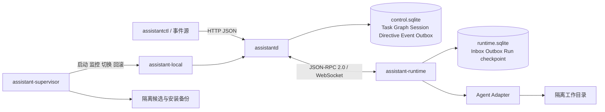

# Work Assistant MVP

## dev 部署（Cursor Agent）

部署目录为 `/data/wangyunlai.wyl/workspace/work-assistant`，使用独立 SQLite 数据和 systemd 用户服务。Cursor Adapter 支持原生 Session 恢复、公开行动事件、进程组中断，以及 Ask 模式下的结构化文本交付。Cursor 认证必须通过真实调用验证；Runtime 在线不代表账户可用。Mac 默认 Codex 部署不受影响。

访问方式、Token、备份边界、构建和维护命令见 [dev 部署说明](deploy/dev/README.md)。Linux 支持 systemd 用户服务托管升级守护进程，使用 Cursor 准备补丁、bubblewrap 隔离验证，人工确认后自动安装和重启。

## 本地工作台（当前推荐入口）

打开 `http://127.0.0.1:17343/`。首页围绕“需要你决定的事、助理对话、安静的运行状态”组织，不再默认进入任务管理。各页共享导航，支持窄屏浏览。

| 页面 | 功能 |
|---|---|
| `/` 首页 | 待验收/待回复/受阻/候选升级收件箱，按文件版本验收、打回或回复；持久化聊天、历史对话、操作确认和系统进化卡片 |
| `/tasks` 工作列表 | 等待队列/推进中/需要你/已完成概览；搜索、状态筛选、详情、实时行动、对话、产物、验收历史和任务总结；创建、暂停、打断并发送 |
| `/members` 成员管理 | 按角色分组浏览 Agent 成员，管理角色职责、AI 草稿及成员的模型/容量/启停；支持角色及草稿深链接 |
| `/team` 团队资料 | 搜索、阅读、添加和复制资料；跳转创建工作时自动选中资料，旧工作快照不变 |
| `/system` 系统状态 | 数据库与调度、在线/离线机器、适配器能力、Agent 容量、执行边界和在线备份 |

### 团队资料

你和所有 Agent 共同组成团队。团队资料保存可复用的目标、协作约定、术语和参考文档；项目资料只是其中一类，不要求关联代码仓库。目前创建工作时可选择一份资料并保存快照，再作为输入交给执行 Agent；不会自动注入所有任务、首页对话或已有 Agent Session，也不替代 Agent 自己管理的会话记忆。

资料保存后只读，可复制为新资料；副本是独立记录，不是原记录的新版本。页面入口为 `/team`，旧 `/projects` 链接仍兼容。现有数据库、`Project` 类型、`/api/v1/projects` API 及 `project_id`/`project` 字段保持不变，无数据迁移，不改写历史记录和快照。

### 系统岗位与可替换 Agent

在 **成员管理 → 系统岗位**（`/members#system-agents`）分别选择首页聊天、角色设计、任务路由、升级构建的执行成员。岗位只保存成员绑定；机器、Adapter、模型和角色指令来自成员配置。修改配置有版本校验与事件记录，SQLite v9 迁移保留原数据，岗位与路由决策随现有备份保存。

- 首页聊天、角色设计默认自动选取在线空闲成员；没有成员时仍可在支持的 Runtime 上设计首个角色。配置具体成员后，离线、停用或满载会明确报错，不偷偷换人。角色设计可对单个新草案显式选择手动执行环境。
- 任务路由默认沿用规则。改为成员后，该成员以只读结构化 Run 从满足角色、能力、排除规则及容量的候选中选人。决策与 Run/outbox 原子保存；轮询和重启不会重复发起同一任务版本的推理。派发前再次校验任务版本、选择结果、成员状态和并发。失败不无限重试：追加任务消息开始新一轮，或显式切回规则路由。路由内部任务不进入业务工作列表或效率总结。
- 新配置只影响新会话/新路由决策。已有任务、聊天、草案继续原成员、原模型快照和原生 Session；进行中的路由决策保留原快照。首页可以显式点击“使用当前配置接手”：必须等本轮结束，新建 Session，保留原 Session/记录，传递最多 12 条最近可见消息（长消息截断），使旧待确认建议失效；不搬运或伪造原生记忆。
- 升级构建支持本机升级守护进程的 `codex-agent` 或 `cursor-agent` 成员。创建升级时固化成员/角色/模型快照，排队和构建占用成员容量；不受之后默认配置改变影响。自动模式沿用守护进程的 `--adapter` / `--model`，如需和普通任务共享容量约束，应明确绑定成员。仍在隔离副本中运行，保留两次人工确认和原安装/回滚边界。其它三个岗位可使用任意已接入、声明所需能力的 Adapter/机器；这不代表任意未接入的 Agent 产品已可用。

配置 API：`GET /api/v1/system/agents`；`PUT /api/v1/system/agents/{slot}`，请求 `{ "mode": "agent", "agent_id": "...", "expected_version": 1 }`。恢复默认时 `agent_id` 为空，路由 `mode=rules`、其它岗位 `mode=auto`。聊天显式接手：`POST /api/v1/home/chats/{chat_id}/executor`，必须提供 `expected_version` 与当前 `binding_version`。这些写入沿用 API Token 和同源校验。

### 首页助理对话

信息咨询只回答，不创建托管工作。首页对话独立复用原生 Agent Session；控制端保存展示记录，原生上下文和压缩仍由 Adapter 管理。首页只使用受大小限制的近期工作摘要、角色能力和运行状态，不是无限历史检索。达到 100 条消息后可新建对话，旧记录保留；目录显示最近 50 个对话。

明确行动可生成 `create_work` / `message_work` / `pause_work` / `create_role` / `upgrade_system` 建议。只有点击确认，服务端才读取保存的建议并执行。建议绑定快照内的工作/角色及版本，新消息使旧建议失效，过期或伪造的对象不能执行。确认与业务写入同事务，重复确认不会重复创建或发消息。

角色建议只创建可编辑草稿，不自动发布或配置员工。已有工作消息交给原 Agent/Session 的下一轮；即时打断在工作详情页操作。**聊天不支持批准验收、合并、删除或其它外部写入；“好的”不替代确认按钮。** 人工验收仍绑定确切的 Run 与文件版本。

`concierge.Assistant` 可替换提示与 Schema；解析及动作执行采用固定安全协议，新增动作必须扩展校验与事务处理，不能只改提示词。运行通过现有只读结构化 Adapter 完成，机器离线或模型失败时显示错误，不伪装为执行成功。

### 系统进化

在首页聊天中明确提出“给这个工作助手增加/修改某个功能”，助理会生成 `upgrade_system` 建议。完整流程有两次互相独立的人工确认：

1. 第一次确认只创建升级记录。独立的 `assistant-supervisor` 把当前源码复制到 `data/.../upgrades/<upgrade-id>/candidate`。Codex 使用 `workspace-write` 修改该副本；Cursor 保持只读 Ask 模式，阅读副本并返回结构化编辑提案，由可信构建器检查路径、唯一文本匹配和保护规则后写入候选。Cursor 不获准执行 Shell、Write 或 MCP。随后，全量 Go 测试、`go vet`、前端语法/单元测试及所有程序构建进入 `ValidationSandbox`，只允许写当前升级工作目录，使用离线依赖缓存和不继承认证变量的最小环境。
2. 测试通过后，首页“需要你”与“系统进化”会展示变更文件、具体代码改动、构建日志和候选摘要。第二次确认绑定记录版本及源码/二进制 SHA-256，候选或线上版本变化后不能继续安装。
3. 确认安装后设置维护锁：不再创建新 Run，已排队或执行中的 Run 结束后才备份控制数据库、Runtime spool、源码和可执行文件。监督进程停止旧子进程、以原子替换和 fsync 切换候选版本并自动启动；健康检查失败会恢复旧源码和二进制后再次启动。代码回滚不覆盖数据库，避免丢失备份后的记录。重启遇到 `INSTALLING` 时先恢复安装再开放服务；无法验证或回滚时保留维护锁并停止服务，不把混合版本当作健康版本启动。

升级记录、确认状态和结果保存在 `control.sqlite`；候选、测试构建和每次安装备份保存在 `data/.../upgrades/`。普通任务依然只有只读分析权限，不能借 `upgrade_system` 绕过两次确认。取消“构建中”的升级会中断候选 Agent；安装开始后不能取消。

第一版有意缩小可自动升级范围：不允许删除文件、修改依赖、控制端/Runtime 数据库结构、升级协议与 API、升级构建器、监督进程、`assistant-local` / `internal/localconfig` 启动策略或健康握手；最多改 200 个文件，供人工检查的完整变更不超过 120 KB。候选目录以外的文件、符号链接、硬链接和非常规文件也会被拒绝；验证前后源码必须完全一致。`ValidationSandbox` 内置 macOS Seatbelt 和 Linux bubblewrap，也可替换；不可用时拒绝构建，不降级为裸执行。Seatbelt 禁止网络；bubblewrap 使用独立网络/PID/挂载命名空间，允许隔离的 loopback 测试服务但不能访问宿主网络，仅只读挂载系统工具、固定编译器和依赖缓存，不挂载宿主凭据、线上数据及用户主目录。沙箱不是虚拟机，也不代表 Agent CLI 本身获得完整秘密读取隔离。若确实需要升级上述信任基础，应人工评审并手工发布新基线。

本机已有构建产物时，双击 `启动工作助手.command`。它沿用 `data/role-studio` 的现有数据和 `local-role-studio` Runtime 身份，先启动唯一的 `assistant-supervisor`，再由监督进程维护控制端和本机 Runtime。子进程异常退出会自动重启；升级时也由这个不会被候选替换的父进程完成切换、健康检查和回滚。终端保持运行，Ctrl+C 停止整个系统；未安装登录自启或后台系统服务。锁文件阻止同一数据目录启动两个监督进程，也不要另外直接启动使用同一数据库的控制端。

其它环境从源码构建并启动：

```bash
go build -o bin/ ./cmd/...
./bin/assistant-supervisor --root . --data ./data/local --model gpt-5.6-sol
```

仍可直接运行 `assistant-local`，但这种启动方式会明确关闭系统进化与自动重启。

需要已安装、已登录且模型可用的 Codex CLI（可用 `--codex-binary` 指定），以及用于候选验证的 Go 工具链（可用 `--go-binary` 指定）。本机启动脚本默认使用 `data/role-studio/.toolchains/go/bin/go`，也可通过 `WA_GO_BINARY` 替换；监督进程会先尝试同一数据目录下的这个持久位置，再尝试自身构建时的 GOROOT。依赖缓存可预置在同一数据目录的 `.toolchains/gomodcache`，验证时只读使用且禁止联网下载；缺少依赖会明确失败。隐藏目录名避免项目自身执行 `go test ./...` 时把工具链源码误识别为应用包。JavaScript 候选改动还要求可用的 Node.js，缺失时会拒绝候选而不是跳过检查。模型名是本次本机验证使用的配置，不保证所有账户可用；成员管理页可为新任务修改。首次启动创建一个“日常工作助手”角色和“本机工作助手”Agent；再次启动保留已有配置，不覆盖用户修改。该程序只允许 loopback 地址，不开放局域网或公网。

当前闭环的明确边界：

- 面向文档、分析、代码建议和只读评审。团队资料和上传的 UTF-8 文本是输入，不是自动读取/写入本机仓库的路径授权；Git worktree、仓库写入、PR 和外部系统事件尚未接入。
- 手工任务使用 `/api/v1/work/tasks`，底层仍是同一套 Task/Run/Event/Session。旧 `/api/v1/tasks` 和角色生成任务保留原手动运行语义，不会在升级时突然自动执行历史任务。
- SQLite 消息表是持久队列：忙碌或离线会持续等待并显示原因；重复调度不会产生并行的重复 Run。执行 Router 仍按角色、能力（AND）或 Agent 确定性选择；首页助理可以建议角色，必须由人确认。表单默认选本机工作助手。
- 普通发送在当前轮结束后处理；“打断并发送”通过可靠 outbox 请求停止，再沿用原 Session 执行待处理消息。暂停阻止自动续跑。中断是请求，不保证瞬间停止，也不会撤销已经发生的操作。
- 原生 Session 记忆仍归具体 Agent。角色和模型修改只影响新 Session；现有 Session 保留快照，原机器离线时等待，不静默迁移。停用 Agent 阻止后续调度，但不杀死当前运行。
- Run 结束不是 Task 完成。Agent 明确返回 `review` / `needs_input` / `blocked`；格式错误会受阻，不能直接批准。验收绑定 Run 和文件版本；普通工作消息使旧验收失效，专用验收沟通不使其失效；关闭后不可继续发消息。
- 每个业务 Task 真正完成时，在同一事务内写入不可变的 `TaskSummary`。Agent 提供实际结果、可复用经验和改进建议；系统独立计算总周期、调度/Runtime 排队、运行、人工验收等待、返工、失败、打断、交付版本和子任务指标，并生成机器可读的效率信号。普通托管工作在人工验收通过时总结，手动 API 创建的业务任务在完成时总结；角色草案和首页聊天的内部 Task 不作为效率样本。旧完成任务由 schema v8 自动回填。
- Task Summary 属于可查询的团队工作记录，不等同于具体 Agent 的 Session Memory。本版不会把所有历史总结无选择地塞回提示词，也不会自动修改角色或路由；后续的效率分析器可通过总结 API 按角色、模型、任务类型和效率信号筛选，再由人确认哪些经验进入团队资料或角色规范。
- 产物为 UTF-8 完整文件，最多 8 个，总结果不超过 120 KiB。SQLite 保存内容、SHA-256 和版本，不覆盖历史。页面纯文本安全预览，可在验收前下载；不执行产物内 HTML/脚本。
- 系统状态页可创建经过校验的恢复点。启动时和每 5 分钟自动备份，默认保存在应用目录之外；组合部署覆盖控制端数据库和 Runtime spool。单独下载的数据库仍只有控制端记录。工作目录、原生 Agent Session、源码/升级候选、认证和外部仓库不在本版自动备份范围，不能把数据库恢复等同于完整环境迁移。
- Runtime 异常退出后的未完成运行会标记失败；用户从页面发送下一步要求后继续，避免自动重复外部动作。`assistant-supervisor` 会维护本机组合进程，但没有无限业务重试。dev 由启用 linger 的 systemd 用户服务在后台托管；Mac 双击启动方式仍是终端前台运行。
- 只读沙箱是文件写入限制，不是容器或完全隔离的操作系统；角色里的工具/外部操作限制不应视为强权限边界。不要让不可信的 Runtime 连接个人控制端。

### 和交付 Agent 验收沟通

首页“查看交付并验收”和工作详情均提供“先和交付者聊聊”。这里联系交付成果的 Agent，不使用首页助理或 Router 的当前默认成员。聊天继续原工作 Session，可多轮询问依据、核对验证结果、讨论修改方案；确认后再明确点击“通过本次验收”或填写意见“要求修改”。

- `ReviewTurn` 绑定验收单、原交付 Run、Agent、Runtime、Adapter、模型及 Session。每轮只创建新的只读 Run，不创建新的 Session；Codex Adapter 必须使用原生会话恢复，不能因引用缺失/无效而静默新建。原机器离线时问题先保存，等待原机器恢复。
- 提问先在 SQLite 事务中保存，通过已有可靠 outbox / JSON-RPC 执行。问题和回复独立于普通工作消息；每张验收单最多 100 轮，一次一个未结束问题，Session 的工作运行和沟通运行不能并发。
- 验收协议仅接受 `{ "message": "..." }`，不解析为新交付物、总结或验收决定。回复失败、格式不合法、主动停止都保留原成果和待验收状态。停止是中断请求，需等执行端确认；不等同于暂停工作或撤销已发生的操作。
- 提问、开始回复、回复结束和排队取消更新 `discussion_version`。验收请求必须带最新版本；排队/回复中、已有普通工作消息时拒绝批准。页面也阻止在未发送提问仍存在时作决定，避免误操作。普通工作改向或暂停仍会使旧验收失效；晚到的聊天回复不会重新交付或复活旧成果。
- 聊天记录与原文件版本一直保留，可在工作详情的验收历史中回看，随数据库恢复点备份。**原生 Session 内部记忆仍由具体 Agent 在原机器保存，不是把工作日志拼成一个新会话；原生 Session 文件不在当前数据库备份范围。** 原生会话已丢失时会明确失败，不能声称还拥有完整原上下文。

服务端可注入 `server.Config.ReviewContract` 选择提示/Schema，默认 `workflow.ReviewContract`；当前回复解析使用固定的消息协议。新 Adapter 需要声明并实际落实 `native_session`、`role_instructions`、`structured_output`、`read_only_runs`，以及 `RunSpec.require_native_session`，不能仅声明能力而不恢复原会话。UI 演练与测试记录见 `REVIEW-CHAT-VERIFICATION.md`。

### Agent 实时行动

工作详情上方的「Agent 实时行动」展示命令、工具调用、文件变更、检索、计划和公开消息。每条卡片固定关联原 Run / Session / 成员 / 机器 / 模型，可展开命令、参数或变更、输出、退出码及错误，按运行轮次筛选。普通工作和验收沟通都沿用原工作 Session；观察本身不创建 Run，不改变权限或执行方向。暂停、打断并发送、停止验收回复继续使用原有确认和中断协议。

当前完整接入 Codex CLI `exec --json` 的公开 `item.started/updated/completed` 事件，格式参考 [Codex 官方非交互执行文档](https://learn.chatgpt.com/docs/non-interactive-mode)。不采集内部推理，也不保证每个字符实时到达：命令在开始/更新/完成事件到达时更新，若 CLI 只在完成时给输出，面板不会提前伪造输出。计划卡片完成表示本次计划发布结束，不代表整个任务完成。未提供原生时长时标为“观察耗时”。没有新事件不等同于 Agent 卡住；页面连接和原机器心跳分别显示，离线时保留最后记录，耗时停止外推。

接入链路是 Adapter → Runtime 的 SQLite outbox → 原 JSON-RPC/WebSocket → 控制端 SQLite 事件及投影（同事务）→ 任务级 SSE → 浏览器。浏览器先取同一读事务下的最新行动快照与游标，再订阅游标之后的事件；断线携带游标续传，自动退避重连，不再每 2.5 秒重建任务详情。其它 Adapter 可上报 `agent.Event.Activity` / `RuntimeEvent.activity`，能力声明为 `structured_activity`；未支持的执行器保留文字日志，不假装支持完整行动观察。

- Action 只是 Run 的观察记录，不是新调度对象。适配器每次 CLI 调用生成独立 scope，防止同一 Run 中续轮的原生 item ID 重用。控制端以 `(run_id, action_id)` 保存最新快照，事件去重仍使用 Runtime 的 epoch/seq；所有身份从已有 Run 校验/补全，不能将任意输出解释为审批或交付。
- `output` 是完整快照，不是增量；重复或较旧的事件不追加重复输出，终态后的活动更新不复活原行动。运行结束而行动没有结束事件时显示“结果未知”；中断显示“已中断”，不会猜测成功，也不声称已撤销外部操作。
- `GET /api/v1/work/tasks/{id}/activities?before=<first_seq>&limit=50` 返回 `items/cursor/has_more/next_before`。`GET /api/v1/work/tasks/{id}/events?after=<global_seq>` 是任务级 SSE，也支持 `Last-Event-ID`；250 ms 查询持久事件，5 秒连接心跳。沿用 Bearer Token，浏览器使用带鉴权头的流式 fetch，不把 Token 写进 URL。`GET /api/v1/work/tasks/{id}?event_limit=30` 限制旧文字日志返回量，不删除历史。
- 页面初始读取最近 50 条行动，可加载更早记录；浏览器缓存约 500 条，数据库完整保留已接收事件和最新投影。长任务的磁盘用量会增长，目前没有自动删除行动历史；备份失败/磁盘告警仍通过既有数据保护机制报告。
- 展示字段在适配器/Runtime 落盘前及控制端写入前对常见密钥格式尽力脱敏，单条命令约 4 KB、详情 8 KB、输出 16 KB，截断有提示；这不是完整防泄漏系统，也不改写旧日志或原始交付文件。页面仅按纯文本渲染，不能执行输出中的 HTML/脚本。
- schema v11 增量添加 `run_activity` 投影和查询索引，已随原恢复点机制备份。升级前的历史日志不改写、不反推补造行动。原生 Session 文件备份、OpenCode / Codex App Server 适配器和逐 token 展示不在本次实现范围。

自动化与页面演练记录见 `ACTIVITY-VERIFICATION.md`。

### 数据与恢复

schema v8 在 v7 基础上增量添加版本化 `task_summary`，迁移事务会为已有的已完成业务任务回填总结，不清空原数据。首页对话和角色草案的内部执行 Task 不进入效率样本。本机切换到 v8 前的备份记录见 `HOME-PAGES-VERIFICATION.md`；更早的 v7/v6/v5/v4 备份仍保留。

schema v9 增加系统岗位与 AI 路由决策；v10 增量添加 `review_turn`；当前 schema v11 增量添加 `run_activity` 和查询索引，原有任务、验收和聊天记录不重写。升级前必须创建并校验恢复点；旧程序不能直接打开新版数据库。

生产入口拒绝打开已丢失、空白、损坏或 schema 比程序更新的数据库，不会静默创建空库。schema 升级前必须成功保存旧库恢复点；备份校验失败则拒绝迁移。原始数据不会被自动删除或自动覆盖恢复。

自动恢复点位于 `os.UserConfigDir()/WorkAssistant/backups/<数据目录标识>/`；macOS 为 `~/Library/Application Support/WorkAssistant/backups/…`。`ASSISTANT_BACKUP_DIR` 可指定专用备份根目录，例如由用户管理的独立磁盘目录；不要指向共享公共目录，不要在原磁盘丢失后用同名本地目录代替外置磁盘。路径本身不能证明异机/异盘保护，本版不自动上传数据或确认外置设备挂载。

每次先写私有临时目录，逐库执行一致性 SQLite 快照（包含已提交 WAL）、`integrity_check`、`foreign_key_check`，生成 SHA-256 / 大小 / 时间清单，fsync 后再发布不可覆盖的新恢复点。失败不替换上一份有效快照；只有新快照成功后才清理本功能管理的旧自动快照，保留最近 48 份以及近 30 天每日最新一份。手动恢复点、已有旧备份和未知文件不自动清理。异常留下的隐藏临时目录不算有效恢复点，需人工检查空间。自动备份失败或超过两个周期未成功会在首页和系统页提示。

```bash
# 离线校验目录中的 manifest.json、文件校验和与 SQLite 完整性
./bin/assistantctl backup-verify --from /absolute/path/to/snapshot-directory
# 只允许写入一个尚不存在的新目录；不覆盖正在使用的数据
./bin/assistantctl restore --from /absolute/path/to/snapshot-directory --to /absolute/path/to/new-recovery-directory
```

恢复会再次验证复制结果，并留下 `RECOVERY_REQUIRED` 启动隔离标记。**不要直接启动或删除该标记**：先离线核对 Task/Run、控制端 outbox、Runtime inbox/outbox、已执行的外部动作，再恢复原机器的工作目录、Agent Session 和稳定 runtime-id。两个 SQLite 文件各自一致，但不是跨数据库的同一事务；备份时尚未完成的工作不能假定可直接重放。需要完成核对和必要的数据修复后，才由操作者明确解除隔离并启动服务；本版没有自动业务对账或一键接管恢复。演练只在新目录进行，不会动生产记录。

日常写入仍使用 SQLite WAL + `synchronous=FULL`；Runtime 完成结果、outbox 和终态原子提交，进程重启后的恢复通知也与状态原子提交。旧进程留下的未送达事件经当前已认证连接重放，沿用原事件身份去重；旧连接依然被隔离。写入失败会停止 Runtime 接收新工作，有限重试后退出等待处理，不把未保存的结果谎报为完成。

这不是“绝对零丢失”：正常自动快照最多相隔约 5 分钟；备份失败时恢复点会更旧。磁盘完全不可写时，尚未落盘的输出仍可能丢失；同盘备份也无法抵御物理损坏、整机丢失或同权限恶意删除。下一层保护需要用户选定独立设备/异机副本，并为原生 Session/工作目录增加对应备份提供者。本版备份为私有权限的明文文件，不包含加密密钥管理或不可变存储；敏感资料应置于加密磁盘并限制访问。

### 工作台 API

所有 API 复用现有 Bearer Token，拒绝跨源浏览器写入。点击连接后，Token 仅保存在当前标签页的 `sessionStorage`，支持跨页面导航；不写入 URL 或 `localStorage`，可随时清除。`GET /api/v1/system` 展示配置/连接就绪，不代表模型账户权限，实际运行才验证模型可用性。

| 请求 | 用途 |
|---|---|
| `GET /api/v1/home` | 人工收件箱和近期工作计数，覆盖最近 500 件工作，最多 50 条待办 |
| `GET/POST /api/v1/home/chats` | 最近对话目录；幂等创建独立对话 |
| `GET /api/v1/home/chats/{id}` | 对话记录与建议状态 |
| `POST /api/v1/home/chats/{id}/messages` | `message`, `expected_version`, `idempotency_key` |
| `POST /api/v1/home/chats/{id}/stop` | 请求中断当前助理回答 |
| `POST /api/v1/home/chats/{id}/proposals/{proposal_id}` | `decision`: `CONFIRMED` / `DISMISSED`；不接受替换动作字段 |
| `GET /api/v1/upgrades` | 最近升级及守护进程启用状态；最新一条包含完整代码改动和日志 |
| `GET /api/v1/upgrades/{id}` | 一条升级的完整持久记录 |
| `POST /api/v1/upgrades/{id}/install` | 第二次确认；必须提交 `expected_version` 和 `candidate_sha256` |
| `POST /api/v1/upgrades/{id}/cancel` | 构建、待确认或排空阶段取消；必须提交 `expected_version` |
| `GET/POST /api/v1/work/tasks` | 列表；提交事件并原子创建任务、首条消息、调度意图 |
| `GET /api/v1/work/tasks/{id}` | 通用 Task 明细、当前完成总结 + 对话、团队资料快照、产物、验收、`review_turns` 沟通记录 |
| `GET /api/v1/work/summaries?limit=100` | 最近完成任务的当前总结；供后续跨任务效率分析 |
| `POST /api/v1/work/tasks/{id}/messages` | `message`, `idempotency_key`, `interrupt` |
| `POST /api/v1/work/tasks/{id}/pause` | 停止调度并请求中断当前运行 |
| `POST /api/v1/work/tasks/{id}/reviews/{review_id}` | `decision`: `APPROVED` / `CHANGES_REQUESTED`，`expected_discussion_version`；打回需 `comment` |
| `POST /api/v1/work/tasks/{id}/reviews/{review_id}/messages` | 原交付 Session 验收沟通；`message`, `idempotency_key`, `expected_discussion_version` |
| `POST /api/v1/work/tasks/{id}/reviews/{review_id}/messages/{turn_id}/stop` | 取消排队问题或请求停止本轮回复，不使待验收成果失效 |
| `GET /api/v1/work/tasks/{id}/artifacts/{artifact_id}` | 下载指定不可变文件版本 |
| `GET/POST /api/v1/projects` | 复用团队资料（名称和文本） |
| `PUT /api/v1/roles/{id}` | `expected_version`, `spec`；原 Role ID 的新版本 |
| `PUT /api/v1/agents/{id}` | `expected_version`, `name`, `model_id`, `max_concurrent`, `state` |

任务调度仍注入 `router.AgentSelector`，业务输出提示/Schema 由 `workflow.Contract` 提供，Adapter 保持原接口。当前业务结果解析采用固定版本的可移植协议；新增结果类型需要对应状态迁移，不是只改提示词。SQLite 持久层尚未抽成可热插拔数据库插件。前端通过 HTTP JSON 轮询；Runtime 仍用 JSON-RPC/WebSocket，无新增服务依赖。

后续再补：Agent 自主拆单工具、跨 Agent 结果回传与多方评审、Multica/GitHub 事件关联、真实仓库工作空间、写入权限、PR 和合并流程。当前托管任务明确拒绝旧手动拆分/直接 Run/Directive 接口，避免绕过消息和验收闭环。

## 底层分布式执行能力与手动 API

一个可运行的分布式工作助手纵向切片。它先把最难替换的基础链路跑通：

- 任务与执行记录持久化；
- manager 自动选择在线机器；
- 控制端与远端 runtime 通过 WebSocket 上的 JSON-RPC 2.0 双向通信；
- 控制命令和执行事件都采用 at-least-once 传递与幂等去重；
- runtime 断线时继续执行，并把事件保存在本地 SQLite spool 中；
- 运行中的 agent 可以被外部命令打断；
- Task 会绑定具体 Agent/Session，后续 Run 自动回到原机器与原 Session；
- Session 记忆由 Agent 自己持有，控制面只记录不透明引用；
- 内置真实 `codex-agent`，支持原生 Codex Session 恢复和按 Session 选择模型；
- 角色工作室：AI 对话生成角色、手动编辑、显式发布，再配置同角色的多个 Agent；
- Task 可声明角色/能力要求与排除的 Agent，Router 按在线状态和负载分配；
- 运行中的 Agent 可以接收持久化 Directive；
- 手动 API 支持动态拆分旧式任务，不要求预编排 Task Graph；尚未提供 Agent 自主调用的拆单工具；
- Agent Adapter 与 Router 都是可替换接口；
- 所有记录可在线备份为单个 SQLite 文件。

这仍不是完整的 Multica/PR 协作产品。托管任务已有人工作品验收门；多 Agent 评审、Claude 等更多 Agent Adapter、GitHub/Multica 连接器和容器级隔离尚未实现。

## 结构



五个程序（工作台和成员管理页面内嵌，无需额外前端服务）：

- `assistantd`：控制面、状态机、事件日志、默认 Router、可靠 outbox、HTTP API。
- `assistant-runtime`：部署到工作机器，维护连接、本地 spool、工作目录和运行中进程。
- `assistantctl`：创建/拆分任务，启动/引导/中断 Run，查看 Session、观察事件和下载备份。
- `assistant-local`：个人本机入口，在一个进程内维护控制面、本机 Runtime 和首次基础配置。
- `assistant-supervisor`：个人部署的稳定父进程，准备候选升级，排空运行，备份、切换、健康检查、回滚并自动重启 `assistant-local`；候选升级不会替换它自身。

## 构建与测试

需要 Go 1.27 或更高版本。

```bash
go test ./...
mkdir -p bin
go build -o bin/assistantd ./cmd/assistantd
go build -o bin/assistant-runtime ./cmd/assistant-runtime
go build -o bin/assistantctl ./cmd/assistantctl
go build -o bin/assistant-local ./cmd/assistant-local
go build -o bin/assistant-supervisor ./cmd/assistant-supervisor
```

仓库里的 `bin/` 是本次验证产生的 macOS arm64 可执行文件；其他平台请从源码构建。

## 五分钟演示

终端一，启动控制面：

```bash
export ASSISTANT_API_TOKEN=change-me-api
export ASSISTANT_RUNTIME_TOKEN=change-me-runtime

./bin/assistantd \
  --listen 127.0.0.1:7337 \
  --db ./data/control.sqlite
```

终端二，启动一台 runtime：

```bash
export ASSISTANT_RUNTIME_TOKEN=change-me-runtime

./bin/assistant-runtime \
  --runtime-id macbook-01 \
  --control-url http://127.0.0.1:7337 \
  --spool ./data/macbook-01-runtime.sqlite \
  --work-root ./data/workspaces
```

runtime 会在 PATH 中发现 `codex` 时自动注册 `codex-agent`；也可以用 `--codex-binary /path/to/codex` 指定位置，或用 `--disable-codex` 关闭。

终端三，创建任务：

```bash
export ASSISTANT_API_TOKEN=change-me-api

./bin/assistantctl task create \
  --title '实现一个示例需求' \
  --goal '执行命令并留下完整事件记录' \
  --idempotency-key manual-demo-001
```

记下返回的 `task_id`，然后启动 run：

```bash
./bin/assistantctl run start \
  --task TASK_ID \
  -- /bin/sh -c 'echo hello; echo warning >&2; sleep 1; echo done'
```

不指定 `--runtime` 时，默认 Router 会从支持目标 Agent Adapter 的在线 runtime 中确定性选择一台；也可显式添加 `--runtime macbook-01`。

```bash
./bin/assistantctl task show --id TASK_ID
./bin/assistantctl run show --id RUN_ID
./bin/assistantctl event watch --after 0
```

同一 Task 再次启动时会自动复用首次分配的 `session_id`、`agent_id`、runtime 和 Session 工作目录：

```bash
./bin/assistantctl session list
./bin/assistantctl session show --id SESSION_ID
```

直接让真实 Codex 处理 Task 时，不需要再提供 shell 命令；Task 的标题和目标会成为 prompt。`--model` 在创建 Session 时绑定，后续 Run 自动沿用同一个模型和 Codex thread：

```bash
./bin/assistantctl run start \
  --task TASK_ID \
  --adapter codex-agent \
  --model gpt-5.6-sol

# 同一个 Task 的下一轮：恢复原 Codex thread
./bin/assistantctl run start --task TASK_ID -- '根据评审意见继续修改并重新验证'
```

如果某台机器的 Codex CLI 默认模型不可用，请在第一次 Run 上显式指定该机器支持的 `--model`；模型会随 Session 固定，避免后续恢复时意外切换。

需要运行中聊天式引导时，选择内置的 `stdio-agent`。它会把每条 Directive 以 NDJSON 写入 Agent 进程 stdin：

```bash
./bin/assistantctl run start --task TASK_ID --adapter stdio-agent -- ./your-interactive-agent
./bin/assistantctl run direct --id RUN_ID --message '先补充测试，再继续实现'
./bin/assistantctl directive show --id DIRECTIVE_ID
```

`codex-agent` 也接受 Directive。基于稳定的 `codex exec` 接口，它会让当前 turn 正常结束，再把已排队的 Directive 作为同一 Codex Session 的下一轮输入；这不是 mid-turn 注入。

运行时动态拆分任务：

```bash
./bin/assistantctl task split --parent TASK_ID --title '子任务 A' --goal '完成模块 A'
./bin/assistantctl task split --parent TASK_ID --title '子任务 B' --goal '完成模块 B'
```

父任务进入 `WAITING_SUBTASKS`。全部子任务到达终态后：如果父 Run 仍在运行，Manager 会自动生成一条包含全部子任务状态的系统 Directive，推送回原 Agent/Session，父任务回到 `IN_PROGRESS`，由它处理成功结果或失败意见；如果父 Run 已结束，全部成功时父任务进入 `ASSIGNED`，存在失败时进入 `BLOCKED`，等待后续恢复决策。

打断运行中的任务：

```bash
./bin/assistantctl run interrupt --id RUN_ID
```

在线下载一致性备份：

```bash
./bin/assistantctl backup --output ./backups/control-$(date +%Y%m%d-%H%M%S).sqlite
```

## 协议与可靠性

### 成员管理与角色工作室

启动控制端和 Runtime 后，打开 `http://127.0.0.1:7337/members`（旧 `/roles` 链接及深链接仍兼容）。成员是具体 Agent，角色是可复用的职责定义；本次命名调整不变更数据库、API 或现有成员身份。如果配置了 API Token，在页面右上角输入；连接后仅保存在该标签页会话存储中，可跨页面使用并随时清除。

1. 新建草案，描述需要的角色，选择生成使用的 Runtime / 模型，点击“发送给 AI”。
2. AI 生成名称、展示简介、能力标签、工作指令、交付标准和边界；可以继续对话，或直接编辑并保存。
3. 检查后点击“确认并发布”。发布不会执行任务。
4. 为发布的角色配置具体 Agent，包括名称、机器、Adapter、模型和并发上限。同一角色可有多个 Agent。

参考 Multica 的 [Build with AI](https://multica.ai/docs/agents-create)，这里把可复用的 Role 与具体执行身份 Agent 分开。展示简介不注入执行 prompt；工作指令、交付标准和边界会注入每一轮执行。角色不限于写代码，也可用于文档、调研、设计等任务。

AI 生成复用现有 Task → Session → Run → Runtime 链路，不在控制端直接调用模型。当前内置 `codex-agent` 支持结构化输出和只读生成；需要该机器已有可用的 Codex 登录态。模型留空使用该机器默认配置，不在角色中硬编码模型。生成任务强制只读；普通角色的权限仍由 Runtime 的沙箱配置决定，prompt 中的“边界”不是安全隔离机制。

CLI 的等价操作：

```bash
./bin/assistantctl role draft --description '需要一位 Go 代码评审员'
./bin/assistantctl role chat --draft DRAFT_ID --message '只评审，不修改代码；能力标签 code.review' --model gpt-5.6-sol
./bin/assistantctl role show --draft DRAFT_ID
# 等待 state 回到 DRAFT，检查配置，再发布
./bin/assistantctl role publish --draft DRAFT_ID
./bin/assistantctl agent create --name reviewer-01 --role ROLE_ID --runtime macbook-01 --model gpt-5.6-sol
./bin/assistantctl task create --title '评审变更' --goal '评审指定变更并报告证据' --requires code.review --exclude-agents AUTHOR_AGENT_ID
./bin/assistantctl run start --task TASK_ID
```

`--model` 的值必须是该 Runtime 实际可用的模型，上例仅为示例。续聊时不用重复传模型。`role edit --draft ID --file role.json --version N` 可提交包含六个配置字段的 JSON；`role draft --from ROLE_ID` 将已发布角色复制为新草案。

路由顺序与当前边界：

- 任务有归属：继续原 Agent / Session，显式冲突参数返回 409，不会静默切换到另一个角色。
- 新任务有 `requirements` 或指定已注册 `agent_id`：先匹配角色、全部能力标签和排除名单，再从在线且有空闲容量的 Agent 中按负载选择；事务内再次检查并发上限。
- 任务/子任务通过 `requirements: {"role_id":"...", "capabilities":["code.review"], "excluded_agent_ids":["..."]}` 声明需要谁。子任务不会自动继承父任务角色。
- 未声明要求的旧任务继续走原 Adapter/Runtime 路由。当前不会仅凭标题自动推断“这是评审任务”，任务创建者/工作流应提供结构化要求。
- 无可用 Agent 时启动返回 409，Task 保留，当前需稍后重试；尚未实现自动等待容量的调度队列。
- 已发布角色不可原地修改；复制为新草案再发布。Session 和 Run 保留角色快照，后续修改不影响已有工作；Session 记忆仍属于具体 Agent。
- 草案支持版本冲突检测；生成时不可同时编辑/发布；失败或打断保留上一份草案。创建、生成请求支持幂等键；发布重试只返回同一角色。
- 角色创建对话是产品记录，不取代 Agent 的 Session memory。控制面记录草案、用户输入、生成结果和 Run；Codex 自己保存推理上下文和原生 Session。
- SQLite v4 自动迁移，角色、草案对话、Agent 注册、任务要求与结果均随现有在线备份保存。恢复实际执行还需备份相应 Runtime 的 spool、工作目录及 Agent 自己的原生 Session 文件。

### API

控制面 HTTP API：

| 方法 | 路径 | 用途 |
|---|---|---|
| `POST` | `/api/v1/tasks` | 幂等创建任务 |
| `GET` | `/api/v1/tasks` | 列出任务 |
| `GET` | `/api/v1/tasks/{id}` | 任务、run 和事件详情 |
| `POST` | `/api/v1/tasks/{id}/subtasks` | 幂等创建动态子任务和边 |
| `POST` | `/api/v1/tasks/{id}/runs` | 创建 run；runtime 可省略 |
| `GET` | `/api/v1/runs/{id}` | 查看 run |
| `POST` | `/api/v1/runs/{id}/directives` | 给运行中 Agent 发送幂等 Directive |
| `POST` | `/api/v1/runs/{id}/interrupt` | 发送可持久化中断命令 |
| `GET` | `/api/v1/directives/{id}` | 查看 Directive 处理结果 |
| `GET` | `/api/v1/sessions` | 列出 Agent Session |
| `GET` | `/api/v1/sessions/{id}` | Session、关联 Task 和 Run |
| `GET` | `/api/v1/runtimes` | 查看 runtime |
| `GET` | `/api/v1/events/stream` | SSE 事件流，可从序号续传 |
| `GET` | `/api/v1/admin/backup` | 下载一致性 SQLite 快照 |
| `GET` | `/api/v1/admin/backups` | 自动备份状态、目录、最近恢复点与错误 |
| `POST` | `/api/v1/admin/backups` | 在固定备份目录创建并验证一个手动恢复点，不接受客户端文件路径 |
| `POST/GET` | `/api/v1/role-drafts` | 创建 / 列出草案 |
| `GET/PUT` | `/api/v1/role-drafts/{id}` | 查看 / 编辑，写入携带 `expected_version` |
| `POST` | `/api/v1/role-drafts/{id}/messages` | 异步 AI 生成/续聊，返回 draft 与 Run，携带 `message`、`expected_version` |
| `POST` | `/api/v1/role-drafts/{id}/publish` | 人工显式发布，携带 `expected_version` |
| `GET` | `/api/v1/roles`、`/api/v1/roles/{id}` | 角色库 / 配置详情 |
| `POST/GET` | `/api/v1/agents` | 注册 / 列出具体 Agent |
| `GET` | `/api/v1/agents/{id}` | Agent 配置、角色和当前负载 |

runtime WebSocket 上目前有六个 JSON-RPC 方法：

- runtime → control：`runtime.hello`、`runtime.heartbeat`、`run.event`；
- control → runtime：`run.start`、`run.interrupt`、`run.directive`。

可靠性边界：

1. 控制端在创建 Run、Subtask 或 Directive 的同一 SQLite 事务里写入状态、事件与 outbox。
2. runtime 必须把 `run.start` 同时写入 inbox 和本地 run checkpoint，才能返回 `accepted`。
3. runtime 为每个输出事件分配持久递增的 `runtime_seq`，控制端落盘后才返回 `durable`。
4. 任一方向连接断开，未确认消息都会重传；接收方按消息 ID 或 `(runtime_id, epoch, runtime_seq)` 去重。
5. runtime 异常重启后，未到终态的本地 run 会报告 `run.failed`，不会悄悄丢失。

因此这里保证的是“至少一次传递 + 幂等消费”，不是脆弱的“恰好一次网络传递”。

## 插件边界

- [`internal/rolebuilder/builder.go`](internal/rolebuilder/builder.go)：角色生成策略接口；通过 `server.Config.RoleBuilder` 注入。返回值必须遵守标准 `message / questions / draft` 契约，由存储层独立校验，不能由生成插件自动发布。
- [`internal/router/roles.go`](internal/router/roles.go)：`AgentSelector` 角色分配接口，通过 `server.Config.AgentSelector` 注入；默认 `LeastLoaded`。插件不能绕过存储事务中的角色、排除名单与容量约束。
- 新执行 Adapter 若支持角色，需要声明 `role_instructions` 并消费 `RunSpec.instructions`；支持 AI 草案生成还需声明 `structured_output`、`read_only_runs`，落实 `RunSpec.output_schema`、`RunSpec.read_only`，并返回 `Result.Output`。这是编译期 Go 接口扩展，尚不是运行时插件市场。现有 `exec-agent` / `stdio-agent` 不声称具备这些能力。

- [`internal/agent/adapter.go`](internal/agent/adapter.go)：接入 Codex、Claude Code、自研 Agent 或文档 Agent。
  - `exec-agent`：argv 执行与流式日志，不支持聊天式引导；收到消息 Directive 会明确标记 `REJECTED`。
  - `stdio-agent`：在上述能力上增加 NDJSON/stdin Directive，可作为真实交互 Agent 的进程适配协议。
  - `codex-agent`：调用稳定的 Codex 非交互 CLI；解析 JSONL 事件，把 `codex:<thread_id>` 保存为不透明 Session 引用，并用 `codex exec resume` 续接。
- [`internal/router/router.go`](internal/router/router.go)：替换 runtime 选择策略。当前新任务使用 `FirstOnline`；已有 Task 则强制使用 Task → Session 亲和性。
- 事件源通过 `POST /api/v1/tasks` 接入，并把 GitHub delivery ID、Multica 工单 ID 等放入 `idempotency_key`。具体连接器不侵入核心状态机。

## Session 与记忆边界

控制面保存 `Task → Session → Agent/Adapter/Model/Runtime` 映射和 `agent_session_ref`，不保存或压缩具体 Agent 的对话上下文。`exec-agent` 和 `stdio-agent` 的引用指向 Session 工作目录；`codex-agent` 的引用是 `codex:<thread_id>`。任务再次执行时，控制面把同一个引用传回同一个 Agent Adapter。

这符合一个明确边界：manager/scheduler 负责 Task 到 Session 的映射；Session Memory 的格式、裁剪、恢复和模型上下文由具体 Agent 负责。

## 隔离与安全边界

当前已实现：

- runtime 只允许工作目录位于 `--work-root` 下，同时检查 `..` 和符号链接逃逸；
- 命令以 argv 执行，核心层不自行拼接 shell；
- `codex-agent` 默认使用 Codex 的 `workspace-write` sandbox，可在每台 runtime 上收紧为 `read-only`；
- API token 与 runtime token 分离；
- 控制面可通过 `--tls-cert` 和 `--tls-key` 直接启用 TLS；
- SQLite 使用 WAL、`synchronous=FULL` 和单写者策略。

普通工作 Runtime 当前尚未实现 OS 级沙箱。`exec-agent` 与 runtime 进程拥有相同系统权限，生产部署不应执行不可信命令；系统升级的候选验证是例外，已单独通过 `ValidationSandbox` 使用 macOS Seatbelt 或 Linux bubblewrap。下一层隔离应实现为 Runtime Executor 插件，例如 Docker/Podman、macOS sandbox 或远端 VM，并加入 CPU、内存、磁盘、网络和超时策略。

## 下一步最自然的演进顺序

1. 增加人工 Review Gate，使评审请求、回复、通过和打回都成为 Directive/Event。
2. 为父 Agent 和 Review Gate 增加自动调度策略；当前活跃父 Run 会收到汇总 Directive，已结束的父 Run 只会把任务恢复为 `ASSIGNED`。
3. 添加 GitHub、Multica 等 Source Adapter。
4. 添加容器 Executor、资源配额与网络策略。
5. 增加 Claude、自研文档 Agent 等 Adapter，并按能力与模型路由。

这个顺序可以保持本版协议兼容：新增的仍然是事件、命令和可替换策略，而不需要推翻控制面与 runtime 的可靠通信模型。
