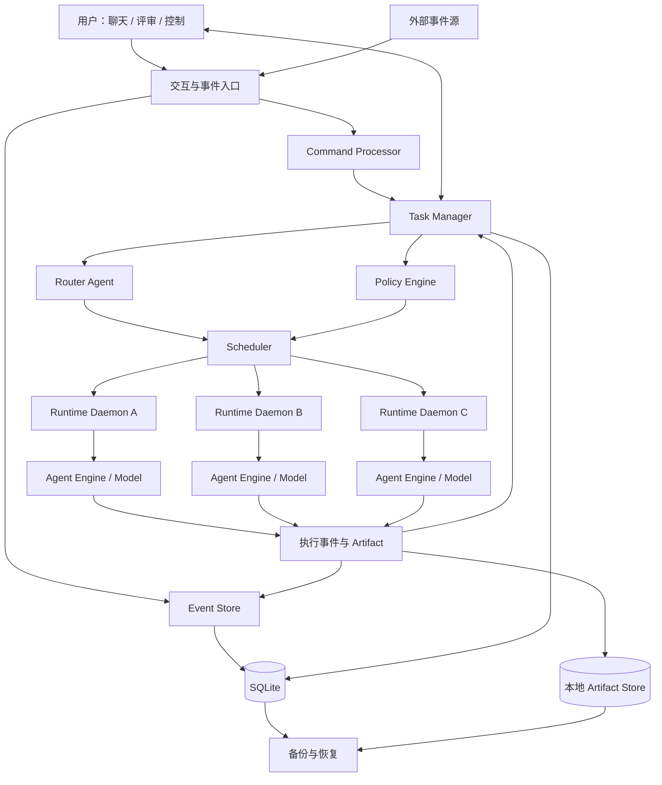
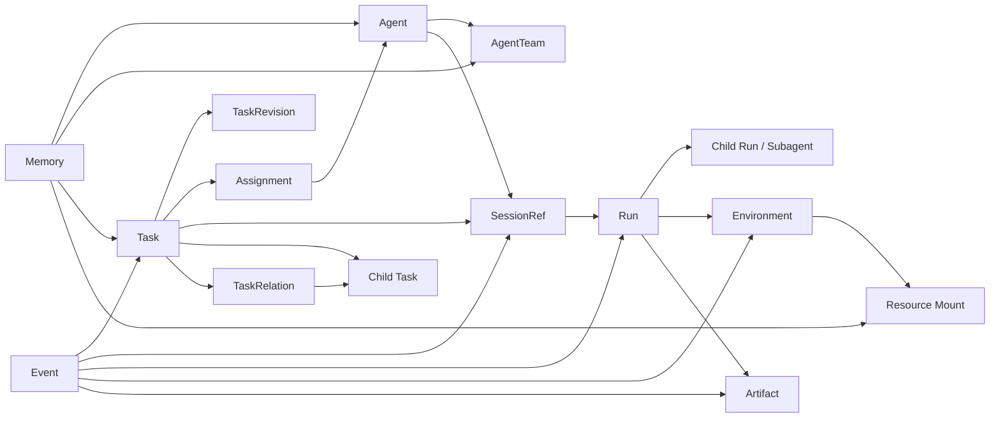
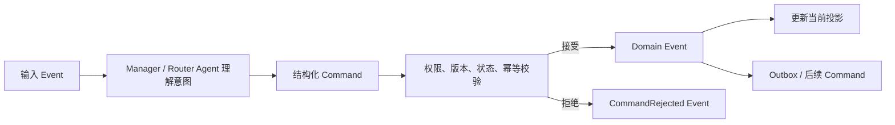

# 日常工作多 Agent 助手：抽象架构设计

> 状态：讨论稿 v0.2  
> 日期：2026-09-04  
> 目标：把多来源任务、Agent 路由、持续会话、多轮 Agent/人工评审、任务拆分、Subagent、记忆、跨机器执行、环境隔离、闭环验收和备份统一到一套尽量小的核心模型中。
>
> 配套验证：[多 Agent 工作助手：用例与真实场景验证](./multi-agent-work-assistant-use-case-analysis.md)

## 1. 系统定位

本系统不是一个“超级 Agent”，而是一个**以 Task 为中心、由 Event 驱动、支持多 Agent 持续协作的工作控制平面**。

它负责：

- 接收并记录工作请求；
- 维护 Task 的长期状态和版本；
- 判断任务应由哪一类 Agent、哪个具体 Agent 接手；
- 对已有任务优先恢复原 Agent 的原 Session；
- 把执行调度到不同机器、Agent Engine 和模型；
- 支持用户通过聊天、评审和控制命令持续介入；
- 支持 Agent 内部使用 Subagent，也支持把独立工作委派为 Child Task；
- 管理跨任务长期记忆，但不接管 Agent 私有的 Session Memory；
- 隔离每个任务的工作环境、权限和外部副作用；
- 保存可审计、可备份、可恢复的完整记录。

### 1.1 当前设计范围

本设计关注抽象模型和模块边界，暂不展开：

- GitHub、Multica 等具体来源的接入协议；
- 某一种 Agent CLI 的具体调用参数；
- Web UI 的页面和交互细节；
- 云端高可用、分布式数据库和大规模消息系统；
- 具体编程语言和框架选型。

### 1.2 已确认的设计取向

1. Task 和 Event 是两条主轴。
2. 当前负责人必须是一个具体 Agent，而不是机器、模型或模糊角色。
3. AgentTeam 是同类 Agent 的能力池，Router 从中选择具体 Agent。
4. 同一个 Task 再次执行时，优先回到原 Agent，并恢复原 Logical Session。
5. Session Memory 由具体 Agent 管理；Manager/Scheduler 只管理 Task、Agent 与 SessionRef 的映射。
6. Agent 之间不建立直接、易失的调用关系，跨 Agent 工作由控制平面可靠中转。
7. Subagent 是 Run Tree 中的 Child Run，不创建独立 Task。
8. 具有独立责任、生命周期或评审要求的拆分工作，创建 Child Task，形成 Task Graph。
9. Squad 暂不作为底层核心实体，而是 Task Graph、Assignment 和 Coordinator 的组合视图。
10. 第一阶段采用 SQLite 和本地文件系统；只有中央控制节点读写 SQLite。

## 2. 架构总览



### 2.1 关键角色

为避免“Manager”一词混淆，系统内部区分：

| 名称 | 职责 |
|---|---|
| Control Manager | 确定性的状态机、命令校验、Event 落库和投影更新 |
| Router Agent | 使用语义、历史归属和能力信息提出路由决定 |
| Scheduler | 选择 Runtime、Environment、Agent Engine 和模型 |
| Coordinator Agent | Root Task 的具体负责人，负责拆解、评审子结果和最终汇总 |
| Worker Agent | 执行具体 Task 或 Child Task |
| Runtime Daemon | 在目标机器上准备环境、启动进程、控制 Run、上报事件 |
| Action Executor | 在批准后执行发布、合并、发消息等高风险外部动作 |

Router Agent 可以提出决定，但不能直接改数据库或绕过 Policy。真正的状态变化必须由 Control Manager 校验并通过 Domain Event 提交。

## 3. 最小领域内核

“有记录、有状态”不等于必须增加一个新的顶层一等公民。当前模型分为三层。

### 3.1 核心对象

这些对象有稳定身份，并跨 Run 或跨 Task 存续：

| 对象 | 核心含义 |
|---|---|
| Event | 已经发生且不可修改的事实 |
| Task | 长期存在的工作目标和协作边界 |
| Actor / Agent | 行为责任主体；Agent 是一种 Actor |
| SessionRef | Task 与 Agent 持续工作会话的稳定引用 |
| Run | 一次具体执行，可形成父子 Run Tree |
| Environment | Agent 可以看见和修改的隔离工作环境 |
| Memory | 可跨执行复用、带作用域和来源的长期知识 |
| Resource | Task 使用的仓库、目录、文档、数据库或远程目标 |
| Artifact | Run 产生的补丁、文档、报告、测试结果等成果 |

### 3.2 版本化记录和控制记录

这些记录可以有自己的 ID 和生命周期，但不必拆成独立服务或顶层聚合：

- TaskRevision；
- Assignment；
- Command；
- Review / Decision；
- CapabilityGrant；
- Checkpoint；
- AgentTeam 及成员关系。

### 3.3 关系和派生视图

- TaskRelation：CHILD_OF、DEPENDS_ON、BLOCKS、DELEGATED_FROM、IMPLEMENTS、REVIEWS 等；
- RunRelation：Parent Run 与 Child/Subagent Run；
- SquadView：Root Task、Coordinator、Child Task 与多个 Assignment 的组合视图；
- Wait 状态：从未完成依赖和 join policy 推导；
- 看板状态、进度和统计：从 Event 与当前投影推导。

只有当用户以后需要独立创建、命名、复用和维护固定小队时，才把 Squad 提升为实体。

## 4. 核心关系模型



一个执行单元可以概括为：

```text
Run = TaskRevision
    + Assignment
    + Agent SessionRef
    + Environment Lease
    + Agent Engine / Model
    + Capability Grants
```

## 5. Event、Command 与 TaskRevision

三者形成“事实—意图—契约”关系：

```text
Event        = 事实：发生了什么
Command      = 意图：希望系统做什么
TaskRevision = 契约：当前究竟要完成什么
```

### 5.1 标准处理链路



所有 Task 都由输入 Event 触发，但输入 Event 不一定最终创建 Task。例如重复请求或权限不足时，可以记录输入 Event，同时拒绝 CreateTask Command。

### 5.2 Event 类型

- 输入 Event：用户请求、外部变化、定时触发；
- Domain Event：TaskCreated、TaskRevisionCreated、AgentAssigned；
- 执行 Event：RunStarted、ArtifactProduced、RunCompleted；
- 控制 Event：CommandDelivered、AgentInterrupted、SessionResumed；
- 评审 Event：ReviewRequested、DecisionRecorded。

每个 Event 至少包含：

```text
event_id
event_type
occurred_at
producer_actor_id
aggregate_type / aggregate_id
sequence
causation_id
correlation_id
payload
```

### 5.3 TaskRevision 边界

TaskRevision 是不可变的工作契约，包含：

- goal；
- scope；
- constraints；
- acceptance criteria；
- required deliverables；
- required resources；
- required review gates。

Assignment、Runtime、Model、Run 状态和 Session 私有内容不属于 TaskRevision。

只有改变“什么算完成、允许做什么、边界是什么”时才创建新 Revision。暂停、恢复、换 Agent、补充普通参考信息，不必产生新 Revision。

每个 Run 必须绑定一个 TaskRevision。运行中出现新 Revision 时，系统根据影响选择：

- 当前 Run 在线接受，并产生 RunRebasedToRevision；
- 打断当前 Run，保留 Session，创建基于新 Revision 的后续 Run；
- 让当前 Run 完成旧 Revision，新 Revision 进入下一次执行。

### 5.4 Command 生命周期

```text
CREATED
→ QUEUED
→ DELIVERED
→ ACKNOWLEDGED
→ APPLIED / REJECTED / EXPIRED
```

Command 必须带目标对象和预期版本，防止“暂停命令到达时目标 Run 已经结束”等竞态。

## 6. Task、Assignment 与路由

### 6.1 AgentTeam 与 Agent

AgentTeam 是同类能力池，例如代码分析、测试、文档、运维。新任务的路由分两步：

1. 判断需要哪个 AgentTeam 或哪些能力；
2. 从候选中选择一个具体 Agent。

当前负责人始终是具体 Agent。

### 6.2 路由优先级

推荐顺序：

1. 用户明确指定；
2. 同一 Task 已有 Assignment，恢复原 Agent 和原 Session；
3. 同一 Resource 或任务类型存在稳定历史归属；
4. 过滤权限、环境、工具和在线状态不满足的 Agent；
5. 根据能力匹配、上下文位置、负载、成本和历史质量评分；
6. 低置信度时进入人工选择。

Router 输出结构化决定：

```text
selected_agent_id
selected_team_id
reuse_session_ref
candidate_agents
excluded_candidates_and_reasons
routing_reasons
confidence
```

### 6.3 谁、哪里、怎样

三个决定必须分开：

```text
Router：谁来做
Policy Engine：允许怎样做
Scheduler：在哪里做
```

Agent 是稳定身份；机器、Agent Engine 和模型可以随 Run 改变。

## 7. Session 模型

### 7.1 Session 所有权

Session Memory 由 Agent 负责。Control Manager 不解析、压缩或拼接 Agent 私有 Session，只保存映射：

```text
task_id
agent_id
session_ref
native_session_ref
runtime_affinity
checkpoint_ref
status
last_active_at
```

### 7.2 Logical Session 与 Native Session

- Logical Session：系统层面对 Task + Agent 连续工作的稳定标识；
- Native Session：具体 Agent Engine 提供的底层 session id，可能绑定机器和工具。

优先恢复 Native Session。无法原生恢复时，由 Agent 根据自己的 Checkpoint、Task Event 增量、授权 Memory 和 Artifact 恢复 Logical Session。

如果更换具体负责人，应创建新 Session，并通过正式 Handoff 传递必要结果；不能把两个 Agent 的私有 Session 合并。

### 7.3 公开记录与私有会话

Control Plane 保存：

- 用户消息和 Directive；
- Agent 主动发布的进度；
- Checkpoint 引用；
- Artifact；
- Review 和 Decision；
- Run 结果。

Agent 自己保存：

- 私有推理上下文；
- Agent Engine 内部 transcript；
- Session 摘要和恢复策略；
- 尚未发布的临时判断。

## 8. Run Tree：Subagent 执行模型

Subagent 是一次 Run 内部的执行拆分，不创建独立 Task：

```text
Task T
└── Agent A / Session S
    └── Main Run R0
        ├── Child Run R1：Subagent
        ├── Child Run R2：Subagent
        └── Child Run R3：Subagent
```

Run 增加：

```text
parent_run_id
root_run_id
run_kind = MAIN | SUBAGENT
spawned_by
depth
required
result_contract
join_policy
```

Subagent 可以由 Agent Engine 原生启动，也可以由 Scheduler 调度到其他 Runtime 或模型。只要它没有独立责任、持久 Session 和人工评审生命周期，仍然属于 Child Run。

### 8.1 Subagent 约束

- 生命周期默认不超过 Parent Run；
- Parent Run 取消时级联取消 Required Child Run；
- 权限是 Parent Run Capability 的子集；
- 深度、fan-out、时间和费用受限；
- 并行写文件时使用独立 overlay/worktree；
- 结果以结构化 Result 和 Artifact 返回 Parent Run；
- 需要跨天、独立恢复或人工评审时，提升为 Child Task。

## 9. Task Graph：独立任务委派

当拆分工作需要独立负责人、Session、Environment、状态或评审时，创建 Child Task：

```text
Root Task：Agent A 负责
├── Child Task B：Agent B 负责
├── Child Task C：Agent C 负责
└── Child Task D：Agent D 负责，依赖 B 和 C
```

Agent A 发出 DelegateWork Command，Control Manager 创建 Child Task 和带属性的 TaskRelation：

```text
relation_type = DELEGATED_FROM
parent_task_id
parent_task_revision_id
child_task_id
requested_by_agent_id
callback_session_ref
input_contract
result_contract
routing_hint
join_policy
failure_policy
capability_ceiling
```

子任务完成后，不直接修改 Root Task，而是：

```text
ChildResultSubmitted Event
→ Manager 持久化 Result 与 Artifact
→ DeliverDelegationResult Command
→ 返回 Coordinator Session
→ Coordinator Review / 汇总 / 要求修改
```

Coordinator 可以成为 Child Task 的 Reviewer。Human 与 Agent 都是 Actor，因此复用同一套 Review / Decision 机制。

评审工作如果由独立 Agent 承担、需要多轮持续、独立 Session 或可审计结论，应创建 Review Task，并用 `REVIEWS` 关系绑定准确的 Artifact revision 或 commit。一次性的辅助检查才放在 Parent Run 的 Subagent 中。

### 9.1 Task Graph 与 Run Tree 的分界

| 判断维度 | Child Run / Subagent | Child Task / Delegation |
|---|---|---|
| 独立负责人 | 否 | 是 |
| 独立 TaskRevision | 否 | 是 |
| 持久 Session | 通常没有 | 有 |
| 独立 Environment | 可选 | 默认有 |
| 可以跨 Parent Run 存活 | 否 | 是 |
| 人工或 Agent Review | 通常不需要 | 支持 |
| 进入任务看板 | 否 | 是 |

### 9.2 Squad 的定位

当前阶段：

```text
SquadView = Root Task
          + Coordinator Assignment
          + Child Task Graph
          + 多个 Agent Assignment
```

Squad 是便于理解和展示的组织视图，不增加新的底层执行语义。

## 10. 人在回路与控制通道

用户对 Agent 的介入分成：

| 操作 | 语义 |
|---|---|
| Guide | 补充方向，在最近消息边界交给 Agent |
| Pause | 在安全点停止，保留 Session 和环境现场 |
| Interrupt | 尽快终止当前推理或工具调用，但不取消 Task |
| Resume | 继续原 Session，可能创建新 Run |
| Cancel Run | 终止本次执行 |
| Cancel Task | 终止整个工作目标 |
| Amend Task | 创建新的 TaskRevision |

控制通道与进度通道分离：

```text
Agent → Control Plane：progress / checkpoint / result / error
Control Plane → Agent：guide / pause / interrupt / resume / cancel
```

如果 Agent Engine 不支持运行中注入消息，降级为：打断当前 turn、保存 Checkpoint、追加 Directive、恢复同一 Logical Session。

### 10.1 Review

正式 Review 不能只是聊天中的一句“可以”。Review/Decision 必须绑定：

- TaskRevision；
- Artifact 版本或校验值；
- 审批范围；
- Reviewer Actor；
- 条件和有效期。

Artifact 发生变化后，旧 Decision 不自动覆盖新版本。

多轮 Review 复用同一个 Review Task、Reviewer Agent 和 Logical Session，每个被评审版本创建新的 Review Run。ReviewFinding 独立记录意见及其解决状态；ReviewGate 根据必需角色、quorum、阻塞级别和版本有效性判断是否可以进入人工评审、Merge 或下一阶段。

外部 Work Item、Child Work Item 和 PR 必须通过 ExternalReference 关联 canonical Task。系统主动创建外部对象后，外部平台回传的 Created Event 只完成关联和对账，不能重复创建 Task。

## 11. Memory 架构

### 11.1 两类目标

```text
工作连续性：由 Agent Session Memory 负责
跨任务复用：由长期 Memory 负责
```

Session Memory 不由 Control Manager 管理。长期 Memory 才进入平台的受控 Memory Store。

### 11.2 长期 Memory 作用域

- Agent Memory：某个 Agent 的长期经验；
- AgentTeam Memory：同类 Agent 共享规范和经验；
- Resource Memory：特定项目、仓库、文档或机器知识；
- Task Memory：已确认、值得后续 Run 使用的信息；
- User / Policy Memory：用户偏好和全局约束。

### 11.3 Memory 生命周期

```text
CANDIDATE
→ ACTIVE
→ SUPERSEDED / EXPIRED / REJECTED
```

Agent 可以提出 MemoryCandidate，但外部输入和 Agent 推测不能自动提升成跨任务、跨 Agent 的权威记忆。

每条 Memory 需要：

```text
memory_id
memory_type
scope_type / scope_id
content_or_artifact_ref
status
confidence
source_event_ids
source_artifact_ids
last_verified_at
valid_until
sensitivity
revision
```

### 11.4 记忆使用边界

Control Plane 根据 scope、权限和敏感度返回可用 Memory 引用；Agent 自己决定如何把这些内容装入 Session。平台记录某次 Run 被提供了哪些 MemoryRevision，便于审计，但不负责生成 Agent 的私有 Session Summary。

优先级原则：

```text
最新用户指令
> 当前 TaskRevision
> 安全 Policy
> 当前 Resource 的已验证事实
> 已验证长期 Memory
> 历史经验
> Agent 推测
```

## 12. Environment 与隔离

```text
Session：Agent 记得什么
Environment：Agent 能看见和修改什么
```

Task 默认拥有持续的 Environment；不同 Run 通过 Lease 使用它。

### 12.1 核心对象

- Runtime：机器或执行节点；
- EnvironmentProfile：隔离策略模板；
- EnvironmentInstance：实际任务环境；
- EnvironmentLease：Run 的独占或只读使用权；
- ResourceMount：Resource 在环境中的挂载方式；
- CapabilityGrant：当前 Run 的短期权限；
- EnvironmentSnapshot：暂停、恢复和迁移用的环境状态。

### 12.2 隔离维度

- 文件系统；
- 进程；
- 凭据；
- 网络；
- CPU、内存、磁盘和运行时间；
- 外部副作用；
- Memory 和 Resource 可见范围。

### 12.3 环境策略示例

| Profile | 典型隔离 |
|---|---|
| 文档任务 | 独立目录，只挂载指定输入 |
| 代码任务 | 独立 worktree/分支，缓存按策略共享 |
| 不可信执行 | 容器或 VM，默认断网，无长期凭据 |
| 远程运维 | 绑定目标机器，限制命令和凭据范围 |
| 高风险生产 | Agent 只产出方案，由批准后的 Action Executor 执行 |

### 12.4 环境不变量

- 两个 Task 不共享同一个可写目录；
- 一个可写 Environment 同一时间只有一个 Active Lease；
- Child Agent 权限不能超过委派者的 capability ceiling；
- Subagent 权限不能超过 Parent Run；
- daemon 管理凭据和环境，Agent 子进程不持有 daemon 管理权限；
- Agent 只通过类型化 API 上报 Event，不能直接写 Control DB。

## 13. Checkpoint、暂停与恢复

可靠 Checkpoint 是多个组件的一致切面：

```text
Checkpoint
├── task_event_sequence
├── task_revision_id
├── assignment_id
├── session_checkpoint_ref
├── environment_snapshot_ref
├── resource_versions
└── artifact_manifest
```

Session Checkpoint 由 Agent 生成，Environment Snapshot 由 daemon 生成，Control Manager 只保存它们与 Task Event sequence 的对应关系。

正常 Pause 流程：

```text
Pause Command
→ Agent 到达安全点
→ Agent 导出 Session CheckpointRef
→ daemon 保存 Environment SnapshotRef
→ CheckpointCreated Event
→ RunPaused Event
→ 释放计算资源
```

异常终止时，使用最近 Checkpoint 加之后已经持久化的 Event 进行恢复。

## 14. 状态模型

### 14.1 Task

```text
NEW
→ ROUTING
→ ASSIGNED
→ IN_PROGRESS
   ├── WAITING_HUMAN
   ├── WAITING_CHILD_TASKS
   ├── BLOCKED
   └── IN_REVIEW
→ COMPLETED / FAILED / CANCELLED
```

### 14.2 Run

```text
QUEUED
→ STARTING
→ RUNNING
   ├── WAITING_SUBRUNS
   ├── INTERRUPTING
   └── PAUSING
→ PAUSED / COMPLETED / FAILED / INTERRUPTED / CANCELLED
```

### 14.3 Environment

```text
PROVISIONING
→ READY
→ LEASED
→ ACTIVE
→ PAUSED / SNAPSHOTTED / QUARANTINED / RELEASED
→ ARCHIVED / DESTROYED
```

Task 完成不等于某个 Run 完成；一个 Task 可以有多个 Run、多个 Revision 和多次 Review。

## 15. Runtime Daemon 与 Agent Adapter

每台工作机器运行一个 daemon，主动连接 Control Plane：

- 注册机器、操作系统、架构和容量；
- 上报 Agent Engine、模型和工具能力；
- 上报 Environment Provider；
- 心跳和 Lease 续期；
- 领取 Run；
- 创建和恢复 Environment；
- 启动、打断、暂停和终止 Agent 进程；
- 上传 Event、Artifact 和 CheckpointRef。

统一 Agent Adapter 协议至少包括：

```text
start_run
resume_session
send_guidance
spawn_subrun
pause_run
interrupt_run
cancel_run
export_session_checkpoint

progress
checkpoint
subrun_started
artifact_produced
result_submitted
completed
failed
```

Adapter 声明能力：

```text
supports_native_session
supports_live_guidance
supports_interrupt
supports_pause
supports_subagents
supports_session_export
```

不支持的能力由 daemon 使用可审计的降级策略实现。

## 16. 本地存储和备份

### 16.1 权威数据位置

第一阶段采用单一 Control Node：

- SQLite 是 Task、Event、Run、Assignment 和索引的唯一权威数据库；
- 远程 daemon 只能通过 API 读写；
- 重要 Artifact 上传或复制到 Control Node 的本地 Artifact Store；
- Runtime 工作目录是可丢弃现场，不是最终记录；
- 需要保证恢复的 Environment Snapshot 必须纳入备份清单。

### 16.2 建议目录

```text
data/
├── assistant.db
├── artifacts/<task-id>/<artifact-id>/
├── memories/<scope>/<memory-id>/
├── session-checkpoints/<agent-id>/<session-ref>/
├── environment-snapshots/<environment-id>/
├── manifests/
└── backups/
```

### 16.3 SQLite 逻辑表

```text
events
tasks
task_revisions
task_relations
actors
agent_teams
agent_team_members
agents
assignments
session_refs
runs
commands
reviews
decisions
review_findings
review_gates
runtimes
environment_profiles
environment_instances
environment_leases
resource_refs
resource_mounts
capability_grants
artifacts
external_references
checkpoints
memories
memory_revisions
memory_sources
memory_usage
outbox
```

Event 表追加写；其他表是当前状态投影或可查询索引。

### 16.4 备份

一次有效备份应包含：

1. 一致的 SQLite 快照；
2. Artifact 和 Memory 文件；
3. 可恢复的 Session Checkpoint 导出；
4. 必需的 Environment Snapshot；
5. manifest、相对路径、大小和 SHA-256；
6. 备份版本和 Event sequence 水位；
7. 定期真实恢复验证。

## 17. 安全与信任边界

### 17.1 默认信任级别

- 外部事件内容：不可信；
- Worker Agent：受约束执行者，不拥有控制面权限；
- Runtime daemon：受信执行节点；
- Control Manager：权威状态机；
- Router Agent：建议者，不是授权者；
- Human Decision：在明确范围和版本内授权。

### 17.2 核心安全原则

- LLM 只能提出 Command，不能直接修改权威状态；
- 外部内容不能自动成为全局 Memory 或 Policy；
- Secret 不进入 Prompt、普通日志或 Artifact；
- 高风险外部动作由独立 Action Executor 执行；
- Approval 绑定 TaskRevision、Artifact 版本和 Capability 范围；
- 委派和 Subagent 都不能扩大权限；
- 所有跨 Agent 交互经 Control Plane 持久化中转。

## 18. 核心不变量

1. Event 只追加，不覆盖。
2. Command 是意图，只有对应 Domain Event 才表示已经发生。
3. TaskRevision 不可变，每个 Run 明确绑定一个 Revision。
4. 一个 Task 的当前负责人是具体 Agent。
5. 同一 Task 默认恢复原 Agent 和原 Logical Session。
6. Session Memory 由 Agent 管理，Control Manager 只保存 SessionRef 和公开结果。
7. Task Graph 表达独立责任；Run Tree 表达一次执行内部的拆分。
8. Child Run 默认不能脱离 Parent Run 存活。
9. Child Task 有独立负责人、Session、Environment 和生命周期。
10. Squad 当前只是派生视图，不增加底层语义。
11. 两个 Task 不共享同一个可写 Environment。
12. 子执行权限不得超过父执行或委派者的权限上限。
13. Review/Decision 必须绑定具体 Revision 和 Artifact 版本。
14. Memory 必须带 scope、来源、状态和版本。
15. 用户的 Guide、Pause、Interrupt 和 Amend Task 具有不同语义。
16. Remote Runtime 不直接访问 SQLite。
17. 外部 Work Item、子工单和 PR 必须关联唯一 canonical Task，重复 Event 不得生成重复工作。
18. Review Decision 只对明确的 subject revision 有效，新 revision 按 Policy 使旧结论失效。
19. 所有 required Child Task 完成只产生 ParentClosureEligible；Root Task 是否关闭仍由 CompletionPolicy 和验收 Decision 决定。

## 19. 第一阶段最小垂直闭环

第一阶段应先证明抽象模型成立，而不是优先接入大量来源。

建议覆盖以下场景：

1. 用户创建 Task，形成 Event 和 Revision 1；
2. Router 从 AgentTeam 中选择具体 Agent；
3. Scheduler 在本地或远程 Runtime 创建隔离 Environment；
4. Agent 开始 Run，并建立 Logical Session；
5. 用户通过聊天发出 Guide；
6. 用户改变任务边界，生成 Revision 2，并打断/恢复原 Session；
7. 主 Agent 创建多个 Child Run/Subagent 并汇总结果；
8. 主 Agent 创建一个独立 Child Task，Router 分配给另一台机器上的 Agent；
9. Child Task 结果经 Control Plane 返回主 Session；
10. Agent 提交 Artifact 并请求用户 Review；
11. 用户批准后 Task 完成；
12. Agent 提出 MemoryCandidate；
13. 系统备份 SQLite、Artifact、Memory 和必要 Checkpoint；
14. 在空目录中恢复，并能继续一个未完成 Task。

## 20. 暂缓决定的问题

以下问题不影响抽象模型，可以在详细设计阶段选择：

- Control Node 上的重要 Artifact 是统一复制，还是允许可靠的远程存储引用；
- 不同 Agent Engine 的 Native Session 如何导出、迁移和加密；
- 哪些聊天意图可以自动生成 Command，哪些必须用户确认；
- TaskRevision 变化后，正在执行的 Child Task 如何自动判定 stale；
- 初期采用进程、worktree、容器还是 VM 作为具体 Environment Provider；
- 长期 Memory 是否需要 embedding，何时从 SQLite FTS 升级；
- 什么时候需要把 SquadView 提升为可复用的 SquadDefinition；
- AgentTeam 成员是人工配置、动态注册，还是二者结合。

## 21. 一句话总结

这套架构的最小内核可以概括为：

```text
Event 保证事实不丢；
Task 与 Revision 定义工作契约；
Agent 与 Session 保证责任和连续性；
Run Tree 支持 Subagent；
Task Graph 支持独立委派；
Environment 与 Grant 限制可见范围和副作用；
Memory 复用经过治理的经验；
Control Plane 负责可靠中转、评审、恢复和审计。
```
