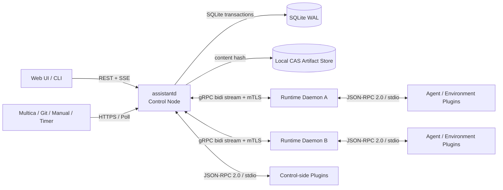
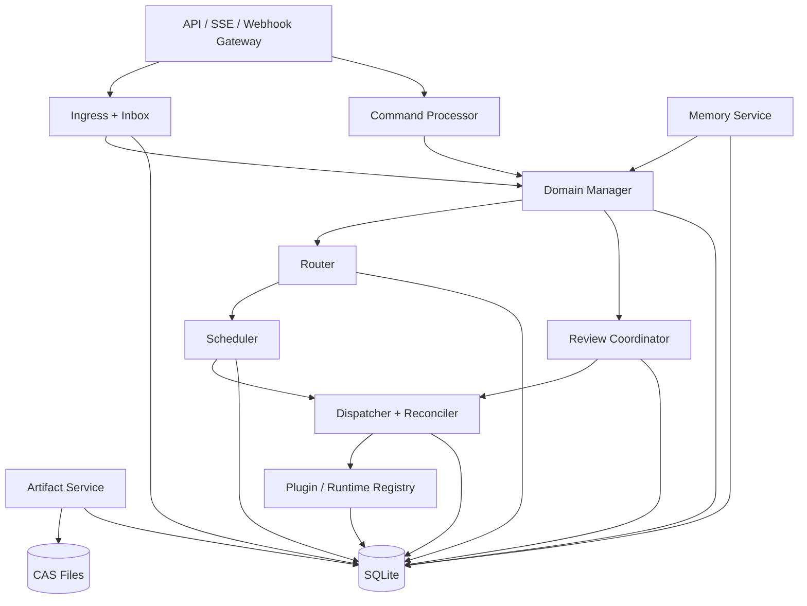
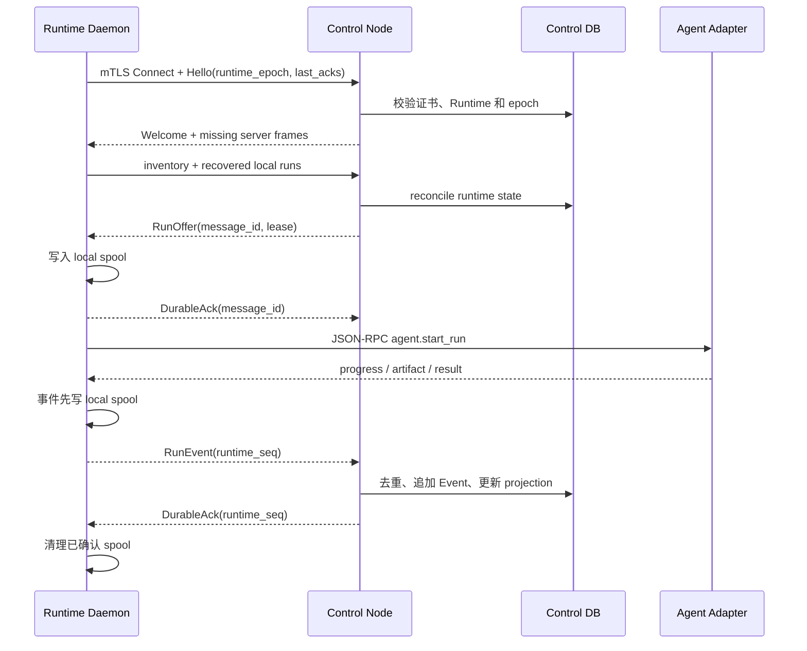

# 多 Agent 工作助手：可实施详细设计

> 状态：详细设计稿 v0.1  
> 日期：2026-09-04  
> 目标读者：准备开始实现该系统的人  
> 设计范围：个人使用、单控制节点、多工作机器、多 Agent/模型、动态任务拆分、机器与人工评审、可恢复和可备份

## 0. 一页结论

第一版采用“**模块化单体控制节点 + 多机 Runtime Daemon + 进程外插件**”，不从微服务开始。



### 0.1 默认技术选型

| 层面 | 第一版选择 | 原因 | 扩展方向 |
|---|---|---|---|
| 控制节点 | Go 1.27.x，单进程模块化单体 | 易部署、并发模型适合 daemon、跨平台单文件 | 保持领域模块边界，必要时再拆服务 |
| Web UI | React 19.x + TypeScript + Vite，静态资源嵌入 Go 二进制 | 适合任务图、聊天、Review 等交互 | UI 可独立部署，不影响 API |
| CLI | Go，与服务端共用 API client | 安装简单，便于运维和自动化 | 其他语言按 OpenAPI 生成 client |
| 权威数据库 | SQLite WAL，本机磁盘 | 符合个人规模、事务完整、备份简单 | `StateStore` 内部接口保留 PostgreSQL 实现位 |
| Go SQLite 驱动 | `modernc.org/sqlite`，固定并审计版本 | 无 CGO，方便 macOS/Linux/Windows 交叉构建 | 可切换系统 SQLite 或 PostgreSQL driver |
| 内部异步队列 | SQLite Inbox/Outbox + 带 Lease 的 worker | 无额外进程，状态与消息同事务提交 | 多控制节点时替换为 NATS JetStream |
| Artifact | 本地文件系统上的 SHA-256 CAS | 无需对象存储，天然去重、易校验 | `BlobStore` 可换 S3、NAS、远端文件系统 |
| Control ↔ Runtime | Protobuf + gRPC 双向流 + mTLS | Runtime 主动出连、类型稳定、适合命令和事件长连接 | `RuntimeTransport` 可增加 WebSocket/SSH Relay |
| Browser ↔ Control | HTTPS REST/JSON + SSE | 写操作清晰；SSE 足够传实时进度且便于断点续传 | 真正需要双向低延迟时再增加 WebSocket |
| Core ↔ Plugin | JSON-RPC 2.0 + `Content-Length` framing + stdio | 语言无关、插件崩溃不拖垮核心、调试简单 | 高频插件可选择 gRPC Unix socket |
| 配置 | TOML + JSON Schema；Secret 只保存引用 | 人工可读并可严格校验 | 配置中心是后续 Provider |
| 观测 | JSON structured log + OpenTelemetry API | 本地可直接看，未来可接任意 backend | OTLP Collector、Prometheus 等 |
| 进程维护 | macOS `launchd`、Linux `systemd --user`、Windows SCM | 使用操作系统原生监督，不自造守护器 | 安装器生成对应 service definition |

当前官方发布记录显示 Go 1.27.1 是 2026-09-01 发布的稳定修订；真正实现时仍应在仓库中锁定精确工具链和依赖版本，而不是依赖“latest”。[Go release history](https://go.dev/doc/devel/release)

### 0.2 明确不采用的方案

- 第一版不使用 Kubernetes、Kafka、Temporal、Redis、独立向量数据库或微服务集群。
- 不使用 Go 原生 `.so` plugin；它的构建和 ABI 耦合不适合跨机器、多语言插件。
- Runtime 不直接连接中央 SQLite，也不通过共享网络文件系统打开数据库。
- Agent、Router 插件和 Source 插件都不能直接修改权威表。
- 不追求“Exactly Once”；采用 At-least-once delivery + 幂等处理 + 对账。
- 不把聊天记录当作唯一任务记录；关键变化必须形成 Event、Command、Finding 或 Decision。

## 1. 设计目标和容量假设

### 1.1 必须满足

1. 任意来源事件可以创建或更新唯一的 canonical Task。
2. 同一 Task 默认回到同一具体 Agent 和同一 Logical Session。
3. Agent 可以动态创建 Child Task，也可以在一次 Run 内使用 Subagent。
4. Agent、人工都可以进行多轮 Review；结论绑定准确 revision。
5. Runtime 可以分布在多台 macOS、Linux 或 Windows 机器。
6. 用户可以 Guide、Pause、Interrupt、Resume、Cancel 和 Amend Task。
7. 控制节点、Runtime 或插件崩溃后不能丢失已确认的任务事实。
8. 数据库、Artifact、Memory 和可导出的 Session Checkpoint 可以一致备份。
9. 数据源、Agent Engine、Environment、路由策略、存储和外部动作具有替换边界。

### 1.2 第一版容量边界

这是设计目标，不是硬编码限制：

- 单用户、单 Control Node；
- 1～20 个 Runtime；
- 20 个左右并行 Agent Run；
- 百级活跃 Task、百万级 Event；
- Artifact 总量由本地磁盘决定；单个大文件不经过 gRPC 控制流。

出现以下需求时再进入分布式控制面：多个 Control 副本、多人同时使用、持续高写入量、跨地域高可用或数据库无法在维护窗口内完成备份。

## 2. 总体模块和进程边界

### 2.1 进程拓扑

| 进程 | 数量 | 部署位置 | 权威状态 | 主要职责 |
|---|---:|---|---|---|
| `assistantd` | 1 | Control 主机 | 是 | API、领域状态机、路由、调度、Review、Outbox、Artifact/Memory 索引 |
| `assistant-runtime` | 每台机器 1 个 | 工作机器 | 否 | 环境准备、Agent 进程控制、离线缓冲、Artifact 上传 |
| Control-side Plugin | 按实例启动 | Control 主机 | 否 | Multica/Git 数据源、外部动作、Memory 索引等 |
| Runtime-side Plugin | 按 Runtime 启动 | 工作机器 | 否 | Agent Adapter、Environment Provider、工具适配器 |
| Web UI | 静态资源 | 由 `assistantd` 提供 | 否 | 任务、聊天、Review、图谱、运行状态 |
| `assistantctl` | 按需 | 任意获授权机器 | 否 | 管理、诊断、备份、插件测试和脚本调用 |

`assistantd` 内部模块先放在同一进程中，通过 Go interface 和显式 application service 调用，不通过本机网络 RPC。这样保留边界，但避免过早引入分布式事务。

### 2.2 Control Node 内部结构



### 2.3 核心与插件的边界

不可插件化的“硬内核”：

- Event 追加写和幂等规则；
- Task/Run/Command 的状态转换；
- TaskRevision 的不可变性；
- Assignment 当前负责人唯一性；
- 权限上限和 CapabilityGrant 校验；
- Review Decision 的版本绑定；
- 数据库事务和 Outbox 原子提交；
- 审计、备份水位和恢复语义。

允许插件提出或执行的内容：

- 解析某个外部数据源；
- 对候选 Agent 评分；
- 选择某种 Environment 实现；
- 驱动某种 Agent Engine；
- 检索某种长期 Memory；
- 执行某个明确授权的外部动作。

插件只能返回 Proposal、Observation 或 Action Result；最终状态变化必须经过硬内核校验并产生 Domain Event。

## 3. 组件详细设计

### 3.1 API Gateway 与交互入口

职责：

- 为 Web UI、CLI 和自动化脚本提供 `/api/v1`；
- 为外部源提供 `/hooks/v1/{plugin-instance}`；
- 校验身份、请求大小、并发和幂等键；
- 将写请求转换成 Input Event 或 Command，不直接改业务表；
- 通过 SSE 提供实时 Event 投影。

关键接口：

```text
POST /api/v1/manual-events
GET  /api/v1/tasks
GET  /api/v1/tasks/{task_id}
POST /api/v1/tasks/{task_id}/commands
POST /api/v1/reviews/{review_id}/findings
POST /api/v1/reviews/{review_id}/decisions
GET  /api/v1/events/stream?after={global_seq}
POST /hooks/v1/{source_instance}
PUT  /api/v1/artifact-uploads/{upload_token}
GET  /api/v1/artifacts/{artifact_id}/content
```

写请求支持：

- `Idempotency-Key`：客户端重试不重复执行；
- `If-Match: <aggregate-version>`：拒绝基于旧 Task 状态的修改；
- `X-Correlation-ID`：把一次业务链路串起来；
- `traceparent`：跨组件观测。

Webhook 收到数据后只完成验签、大小限制、持久化 Inbox 和返回 `202 Accepted`；解析和路由异步完成。

### 3.2 Source Adapter

Source Adapter 是进程外插件。Multica、Git、人工触发、定时器分别是不同插件实例。

统一方法：

```text
source.verify(raw_headers, raw_body) -> VerificationResult
source.normalize(raw_event_ref) -> CanonicalInputEvent[]
source.poll(cursor, limit) -> PollResult             # 无 webhook 时使用
source.reconcile(external_ref) -> ObservedState
source.render_link(external_ref) -> URL
```

CanonicalInputEvent 至少包含：

```text
event_id
source_type
source_instance_id
external_event_id
external_object_type
external_object_id
event_type
actor_ref
occurred_at
subject_revision
correlation_key
raw_payload_artifact_id
normalized_payload
```

Source Adapter 不决定是否创建 Task。它只陈述“外部发生了什么”；Task Manager 根据 ExternalReference、映射规则和 Policy 生成 `CreateTask`、`AppendDirective`、`AttachPR` 等 Command。

### 3.3 Domain Manager

Domain Manager 是确定性内核，按 aggregate 串行提交 Command：

```text
Load aggregate snapshot
→ Validate command + expected version
→ Decide domain events
→ Append events
→ Update projections
→ Insert outbox messages
→ Commit one SQLite transaction
```

它管理：Task、TaskRevision、TaskRelation、Assignment、SessionRef、Run、Command、Review、Finding、Decision、CapabilityGrant 和 ExternalReference。

禁止在事务内调用网络、LLM、插件或 Agent。所有外部调用都通过 Outbox 在提交后执行。

### 3.4 Router

Router 分为两层：

1. Core Filter：确定性排除不具备权限、能力、资源位置或在线 Runtime 的 Agent；
2. Scorer Plugin：按语义匹配、历史亲和性、负载、成本和质量进行排序。

默认评分优先级：

```text
用户明确指定
> 当前 Task 原 Agent + 原 Session
> 相同 Resource 的历史 Agent
> 相同 AgentTeam 内的能力匹配
> 数据/环境本地性
> 当前负载、预算和模型成本
```

LLM Router 只能输出：候选、分值、理由和置信度。Core Filter 再校验一次，最后由 Domain Manager 记录 `AgentAssigned` Event。

Router 插件 SPI：

```text
router.rank(task_snapshot, candidates, history_digest) -> RankedCandidates
router.explain(decision_id) -> Explanation
```

### 3.5 Scheduler 与 Dispatcher

Router 决定“谁”，Scheduler 决定“在哪里、用什么方式运行”。

Scheduler 输入：

- Agent 的 adapter/model profile；
- Runtime OS、arch、工具、资源、在线状态和空闲 slot；
- Resource 数据位置；
- Environment Profile；
- Capability ceiling；
- affinity/anti-affinity；
- 用户指定的机器或成本约束。

输出一个 `RunPlacement`：

```text
run_id
runtime_id
runtime_epoch
agent_adapter_instance
model_profile
environment_profile
resource_mount_plan
capability_grant_ids
lease_expires_at
```

Dispatcher 从 Outbox 领取 `StartRun` 等消息，经 gRPC 发给 Runtime。任何发送失败只改变 delivery 状态，不直接改变 Run 的业务状态。

### 3.6 Review Coordinator

Review Agent 使用普通 Task：`task_kind=REVIEW`。同一种 review role 在多轮中复用 Task、Agent 和 Session，只为新 subject revision 创建新 Run。

Review Policy 插件负责提出要求：

```text
review_policy.plan(task_revision, artifact_manifest)
  -> required_roles + quorum + separation_rules + human_gate

review_policy.evaluate(review_snapshot)
  -> proposed_gate_status + reasons
```

Core 强制检查：

- Decision 精确绑定 design revision、Artifact hash 或 commit SHA；
- 新 revision 按 Policy 将旧 Decision 置为 `STALE`；
- blocking Finding 未解决时不能通过；
- Reviewer 与作者职责分离；
- 人工批准必须是明确 Decision，不能从聊天沉默推断；
- Merge 只针对已批准的精确 revision。

### 3.7 Memory Service

Memory 分两层，不能混用：

| 类型 | 所有者 | 默认存储内容 | Control 能否直接修改 |
|---|---|---|---|
| Session Memory | Agent Adapter | Agent 原生 session/checkpoint | 否，只保存 SessionRef 和导出引用 |
| Long-term Memory | Control | 经治理的跨 Task 知识 | 可以，通过 MemoryRevision/Event |

第一版长期 Memory 采用 SQLite FTS5 做关键词检索，结合 scope、tags、Resource、时间和使用反馈排序；不要求部署向量数据库。

Memory 插件边界：

```text
memory.index(memory_revision)
memory.search(query, scopes, filters, limit)
memory.remove(memory_revision_id)
memory.health()
```

可选实现：SQLite FTS5、embedding + 本地向量索引、SeekDB、Qdrant 等。无论使用哪种索引，Memory 原文、版本、scope、来源和批准状态仍由 Control Database 管理；索引可以重建，不能成为唯一真相。

每次注入 Agent 的 Memory 都记录 `MemoryUsed` Event，便于追溯错误知识是怎样影响结果的。

### 3.8 Artifact Service

第一版使用本地 Content-Addressed Store：

```text
data/blobs/sha256/ab/abcdef...       # immutable content
data/staging/<upload-id>.part        # 上传中
data/manifests/<manifest-id>.json    # 文件集合和来源版本
```

写入流程：

```text
写 staging
→ 计算 SHA-256 和 size
→ fsync 文件
→ 原子 rename 到 CAS 路径
→ fsync 目录
→ SQLite 事务登记 artifact + artifact_link
```

相同 hash 不重复保存。Task 只通过 `artifact_link` 引用 Blob，因此同一补丁或报告可以被多个 Review Task 使用。

Artifact Provider SPI：

```text
blob.begin_put(expected_size, expected_hash) -> UploadSession
blob.commit_put(upload_id) -> BlobRef
blob.open(blob_ref, range) -> ByteStream
blob.stat(blob_ref) -> BlobMetadata
blob.delete(blob_ref) -> Result
```

大文件通过独立 HTTPS 上传接口传输；gRPC 控制流只发送 BlobRef、hash、size 和 upload token。

### 3.9 Environment Orchestrator

内置三种 Provider：

| Provider | 适合场景 | 隔离级别 |
|---|---|---|
| `host-dir` | 只读文档、低风险脚本 | 低；依赖 OS 用户权限 |
| `git-worktree` | 常规代码 Task | 中；每 Task 独立工作树和分支 |
| `docker` | 不可信构建、依赖冲突、安全评审 | 高；容器、挂载和网络策略 |

后续可以增加 VM、Kubernetes、远程沙箱 Provider。

Environment SPI：

```text
environment.inspect_capabilities()
environment.plan(profile, resources, grants)
environment.create(plan)
environment.attach(environment_id, run_id)
environment.exec(...)
environment.snapshot(environment_id)
environment.restore(snapshot_ref)
environment.release(environment_id)
environment.destroy(environment_id)
```

两个 Task 默认不能共享同一个可写 Environment。Environment Lease 带 epoch 和过期时间，旧 Runtime 重新上线后不能继续使用已经转移的 Lease。

### 3.10 Agent Adapter

Agent Adapter 把 Codex CLI、其他 Agent CLI、SDK Agent 或自研模型统一成一种协议。

请求方法：

```text
agent.capabilities
agent.create_session
agent.start_run
agent.resume_session
agent.send_guidance
agent.pause_run
agent.interrupt_run
agent.cancel_run
agent.export_checkpoint
agent.shutdown_session
```

通知事件：

```text
agent.progress
agent.message
agent.tool_call_started
agent.tool_call_finished
agent.subrun_started
agent.artifact_produced
agent.checkpoint_created
agent.result_submitted
agent.completed
agent.failed
```

每个 Adapter 声明真实能力，例如 `supports_live_guidance`、`supports_pause`、`supports_session_export`、`supports_native_subagents`。不支持时由 Runtime 使用“Interrupt → 保存公开现场 → Resume Logical Session”的降级流程，不能伪造原生能力。

### 3.11 Action Executor

创建 Multica 子工单、提交/合并 PR、发消息、发布文件都属于外部副作用，通过 Action Executor 插件执行。

统一接口：

```text
action.plan(command, observed_state) -> ActionPlan
action.execute(plan, idempotency_key, capability_token) -> ActionReceipt
action.reconcile(receipt_or_external_ref) -> ObservedState
```

动作状态：

```text
PLANNED → DISPATCHED → CONFIRMED
                     ├── FAILED
                     └── UNKNOWN_EFFECT → RECONCILING → CONFIRMED / FAILED
```

网络超时只能进入 `UNKNOWN_EFFECT`，不得直接重做非幂等动作。必须先用 correlation key、远端对象 ID 或查询 API 对账。

## 4. 通讯协议

### 4.1 协议选择矩阵

| 链路 | 协议 | 交付语义 | 说明 |
|---|---|---|---|
| Browser/CLI → Control | REST/JSON over HTTPS | 请求幂等 | OpenAPI v3；写入携带 idempotency/expected version |
| Control → Browser | SSE | 至少一次展示 | 使用 `Last-Event-ID=global_seq` 恢复 |
| External Source → Control | HTTPS webhook 或 poll | 至少一次 | 原始事件先进入 Inbox |
| Control ↔ Runtime | gRPC bidirectional stream + Protobuf + mTLS | 应用层至少一次 | 双方主动 ACK，断线按 seq 补发 |
| Control/Runtime ↔ Plugin | JSON-RPC 2.0 over stdio | request/response + notification | `Content-Length` framing；插件进程隔离 |
| Runtime → Artifact Store | HTTPS PUT/GET | hash 校验 | 控制与大文件流量分离 |

gRPC 原生支持双向流且每个方向在单次 RPC 内保持消息顺序，适合 Runtime 主动建立长期连接；断线重连后的去重仍由本系统的 message ID 和 sequence 完成。[gRPC core concepts](https://grpc.io/docs/what-is-grpc/core-concepts/)

### 4.2 统一消息 Envelope

所有跨进程消息都有统一语义字段：

```text
protocol_version
message_id                 # UUIDv7
sender_id
sender_epoch
delivery_seq
sent_at
correlation_id
causation_id
aggregate_type
aggregate_id
expected_aggregate_version
traceparent
payload_type
payload
```

规则：

1. 收方必须以 `message_id` 去重。
2. 收方持久化后才能返回 DurableAck。
3. ACK 丢失时发送方允许重发相同 message，不生成新 ID。
4. `delivery_seq` 只保证某条连接方向的补发位置，不替代 aggregate version。
5. 业务状态只能由 Domain Event 改变，Transport ACK 不是业务完成。

### 4.3 Runtime gRPC 协议

Protobuf 草案：

```proto
syntax = "proto3";

service RuntimeControl {
  rpc Connect(stream RuntimeFrame) returns (stream ControlFrame);
}

message RuntimeFrame {
  Envelope meta = 1;
  oneof body {
    RuntimeHello hello = 10;
    Heartbeat heartbeat = 11;
    DurableAck ack = 12;
    RunEvent run_event = 13;
    ArtifactReady artifact_ready = 14;
    RuntimeInventory inventory = 15;
  }
}

message ControlFrame {
  Envelope meta = 1;
  oneof body {
    Welcome welcome = 10;
    DurableAck ack = 11;
    RunOffer run_offer = 12;
    RunCommand run_command = 13;
    LeaseUpdate lease_update = 14;
    InventoryRequest inventory_request = 15;
  }
}
```

Protobuf schema 只追加字段；删除字段后保留 field number 和 name，避免未来复用造成不兼容。[Protobuf compatibility guidance](https://protobuf.dev/programming-guides/proto3/#updating)

连接过程：



### 4.4 Plugin JSON-RPC 协议

选择标准 [JSON-RPC 2.0](https://www.jsonrpc.org/specification)，传输使用 stdin/stdout。每条消息采用类似 LSP 的 framing：

```text
Content-Length: 123\r\n
Content-Type: application/json\r\n
\r\n
{...123 bytes...}
```

stderr 只用于插件日志；stdout 只能输出协议帧。插件禁止把普通日志混入 stdout。

初始化：

```text
core starts process
→ initialize(core_api_versions, plugin_instance, config, granted_capabilities)
→ plugin returns selected_api_version, capabilities, build_info
→ health.ready
→ normal calls/notifications
→ shutdown(deadline)
```

JSON-RPC notification 没有响应，不能用于需要确认的控制命令；Start、Interrupt、Action Execute 等必须使用带 `id` 的 request。

## 5. 插件系统

### 5.1 插件类别

| kind | 运行位置 | 第一版内置实现 | 可替换示例 |
|---|---|---|---|
| `event_source` | Control | manual、timer、generic-webhook | Multica、GitHub、mail |
| `router_scorer` | Control | rules + weighted score | LLM router、成本优化器 |
| `scheduler_policy` | Control | capability + load + affinity | 数据本地性、预算策略 |
| `review_policy` | Control | role/quorum rules | 安全等级、仓库定制规则 |
| `memory_index` | Control | SQLite FTS5 | SeekDB、Qdrant、remote RAG |
| `blob_store` | Control | local CAS | S3、NAS、remote CAS |
| `action_executor` | Control | generic HTTP/manual approval | Multica、Git provider、IM |
| `secret_provider` | Control/Runtime | OS keychain/file ref | Vault、KMS |
| `agent_adapter` | Runtime | generic CLI adapter | Codex、其他 Agent SDK |
| `environment_provider` | Runtime | host-dir、git-worktree、docker | VM、Kubernetes、sandbox service |
| `runtime_transport` | Core build | gRPC | WebSocket、SSH relay |
| `state_store` | Core build | SQLite | PostgreSQL |

`state_store` 和 `runtime_transport` 是安全及事务关键路径：保留 Go interface 和编译期实现选择，但第一版不允许任意外部进程插件替换。其余插件默认进程外运行。

### 5.2 Manifest

```toml
manifest_version = 1
id = "example.multica-source"
kind = "event_source"
version = "1.2.0"
protocol = "jsonrpc-stdio"
api_version = "work-assistant.plugin/v1"
executable = "bin/multica-source"

[entrypoint]
args = ["serve-plugin"]

[capabilities]
methods = ["source.verify", "source.normalize", "source.poll", "source.reconcile"]

[permissions]
network_hosts = ["multica.example"]
filesystem_read = []
filesystem_write = []
secret_refs = ["secret://multica/pat"]

[config]
schema = "config.schema.json"
```

Manifest 中的 permission 是声明和审核依据；真正隔离由 OS 用户、容器、目录 allowlist 和 Capability Broker 执行，不能把声明本身当成沙箱。

### 5.3 插件生命周期和升级

```text
DISCOVERED → VALIDATED → STARTING → READY
                                  ├── DEGRADED
                                  ├── CRASHED → BACKOFF → STARTING
                                  └── DRAINING → STOPPED
```

- Core 校验 manifest、文件 hash、签名/allowlist、API major version 和配置 schema。
- 同一个 plugin package 可以有多个 instance，各自拥有独立配置和权限。
- 升级采用新 generation：启动新进程、健康检查、原子切流、旧进程 drain。
- 五分钟内连续崩溃五次后置为 `DISABLED_CRASH_LOOP`，等待人工或配置变化。
- 插件不能直接打开 `assistant.db`；所有读写通过精简 Plugin Context API。
- 提供 `assistantctl plugin validate/test` 做协议、权限和故障契约测试。

### 5.4 API 兼容策略

- API version 使用 `work-assistant.plugin/v1`，major 不兼容时拒绝启动。
- minor 能力通过 `capabilities` 协商，不靠版本字符串猜测。
- JSON 请求新增字段必须 optional；插件忽略未知字段。
- Protobuf 删除字段必须 `reserved`；不得重用 tag。
- Event payload 带 `schema_version`，升级器只做纯数据转换。
- Core 至少维护当前 major 下一个稳定旧 minor 的兼容测试集。

## 6. 数据库和持久化

### 6.1 SQLite 配置

第一版要求 SQLite 文件位于 Control 主机本地磁盘。SQLite 官方明确说明 WAL 依赖同机共享内存，不适合让不同主机通过网络文件系统共同访问；WAL 允许 reader 与 writer 并发，但仍然只有一个 writer。[SQLite WAL](https://www.sqlite.org/wal.html)

启动配置：

```sql
PRAGMA journal_mode = WAL;
PRAGMA synchronous = FULL;
PRAGMA foreign_keys = ON;
PRAGMA busy_timeout = 5000;
PRAGMA wal_autocheckpoint = 1000;
```

实现约束：

- 一个 writer goroutine 串行执行写事务；read pool 独立。
- 写入使用短事务，任何网络/LLM/插件调用都在事务外。
- 关键写入使用 `BEGIN IMMEDIATE`，尽早发现 writer 冲突。
- 空闲时主动 checkpoint；备份前执行受控 checkpoint/backup。
- 启动时检查 SQLite runtime version。使用 WAL 时至少要求 3.51.3 或包含官方 WAL-reset 修复的 backport；这是 2026 年官方文档列出的修复边界。[SQLite WAL reset fix](https://www.sqlite.org/wal.html#walreset)
- driver 版本写入 build manifest；升级 driver 必须运行崩溃恢复和并发写测试。

### 6.2 Event Store：审计主轴

关键表：

```sql
CREATE TABLE event_log (
    global_seq          INTEGER PRIMARY KEY AUTOINCREMENT,
    event_id            TEXT NOT NULL UNIQUE,
    aggregate_type      TEXT NOT NULL,
    aggregate_id        TEXT NOT NULL,
    aggregate_seq       INTEGER NOT NULL,
    event_type          TEXT NOT NULL,
    schema_version      INTEGER NOT NULL,
    occurred_at_ms      INTEGER NOT NULL,
    recorded_at_ms      INTEGER NOT NULL,
    producer_actor_id   TEXT,
    causation_id        TEXT,
    correlation_id      TEXT,
    payload_json        TEXT NOT NULL,
    UNIQUE (aggregate_type, aggregate_id, aggregate_seq)
);

CREATE INDEX event_log_correlation_idx
ON event_log(correlation_id, global_seq);
```

`global_seq` 用于 SSE cursor、增量备份水位和 projection 重放；`aggregate_seq` 用于乐观并发。Event 不允许业务代码执行 UPDATE/DELETE。

### 6.3 Inbox/Outbox

```sql
CREATE TABLE inbox_event (
    inbox_id             TEXT PRIMARY KEY,
    source_instance_id   TEXT NOT NULL,
    external_event_id    TEXT NOT NULL,
    received_at_ms       INTEGER NOT NULL,
    raw_artifact_id      TEXT,
    status               TEXT NOT NULL,
    error_json            TEXT,
    UNIQUE(source_instance_id, external_event_id)
);

CREATE TABLE outbox_message (
    message_id            TEXT PRIMARY KEY,
    destination_type      TEXT NOT NULL,
    destination_id        TEXT NOT NULL,
    message_type          TEXT NOT NULL,
    payload_json          TEXT NOT NULL,
    status                TEXT NOT NULL,
    attempts              INTEGER NOT NULL DEFAULT 0,
    next_attempt_at_ms    INTEGER NOT NULL,
    lease_owner           TEXT,
    lease_expires_at_ms   INTEGER,
    created_at_ms         INTEGER NOT NULL,
    delivered_at_ms       INTEGER
);

CREATE INDEX outbox_due_idx
ON outbox_message(status, next_attempt_at_ms);
```

领域 Event、Projection 更新和 Outbox 插入处于同一事务。Dispatcher 用 Lease claim 一批消息，发送成功且收到 DurableAck 后标记 delivered；进程崩溃后 Lease 到期即可重领。

### 6.4 业务表目录

| 表组 | 表 | 说明 |
|---|---|---|
| 输入/消息 | `inbox_event`, `outbox_message`, `idempotency_key` | 去重、异步投递 |
| 任务 | `task`, `task_revision`, `task_relation` | 当前投影和不可变契约 |
| 责任 | `actor`, `agent`, `agent_team`, `team_member`, `assignment` | 具体负责人和历史 |
| 会话/执行 | `session_ref`, `run`, `run_relation`, `command`, `checkpoint` | Logical Session、Run Tree、控制命令 |
| 评审 | `review`, `review_round`, `review_finding`, `decision`, `review_gate` | 多角色多轮评审 |
| 外部关联 | `external_reference`, `external_action` | Multica 工单、PR 和对账 |
| Runtime | `runtime`, `runtime_capability`, `runtime_connection`, `lease` | 在线状态和资源租约 |
| 环境 | `environment`, `environment_snapshot`, `resource_ref`, `resource_mount` | 隔离现场和输入版本 |
| 权限 | `capability_grant`, `secret_ref`, `policy_decision` | 范围、期限和审计 |
| 成果 | `blob`, `artifact`, `artifact_link`, `manifest` | CAS 元数据和业务引用 |
| 记忆 | `memory`, `memory_revision`, `memory_source`, `memory_usage` | 长期知识治理 |
| 扩展 | `plugin_package`, `plugin_instance`, `plugin_generation` | 插件配置和状态 |
| 投影 | `task_search`, `task_graph_edge`, `dashboard_counter` | 可重建查询模型 |

JSON 只用于版本可能变化的 payload、policy config 和 provider-specific metadata。需要过滤、关联或约束的字段必须建成普通列，避免把数据库变成不可查询的 JSON 文件堆。

### 6.5 关键事务

#### 外部事件进入

```text
BEGIN IMMEDIATE
→ INSERT inbox_event（唯一键去重）
→ INSERT input Event
→ INSERT normalize outbox message
COMMIT
→ 202 / DurableAck
```

#### Command 提交

```text
BEGIN IMMEDIATE
→ 校验 aggregate version、权限、状态
→ INSERT command
→ APPEND Domain Event(s)
→ UPDATE projection(s)
→ INSERT outbox message(s)
COMMIT
```

#### Runtime Event 上报

```text
BEGIN IMMEDIATE
→ 以 runtime_id + runtime_epoch + runtime_seq 去重
→ APPEND execution Event
→ UPDATE Run/Task projection
→ 根据结果插入后续 Command/Review Outbox
COMMIT
→ DurableAck
```

### 6.6 Runtime 本地 Spool

每个 Runtime 有自己的非权威 `runtime.db`：

```text
received_control_message   # 已持久化但可能未执行的命令
emitted_runtime_event      # 尚未被 Control ACK 的事件
local_run                  # PID、adapter session、environment 等恢复线索
artifact_upload            # 等待上传或确认的 Blob
```

断网时 Agent 可以继续执行允许离线完成的步骤，事件和 Artifact 先进入 spool；涉及新权限、人工批准或外部动作时必须暂停。Control ACK 后才能清理对应记录。

## 7. 任务调度、环境和 Session

### 7.1 Agent 定义

```toml
[[agents]]
id = "code-agent-01"
team = "implementation"
adapter = "codex-cli-default"
model_profile = "coding-balanced"
allowed_runtimes = ["dev-mac", "linux-builder-*" ]
capabilities = ["git", "cpp", "python", "review-reply"]
max_concurrent_runs = 1
```

Agent 是稳定责任身份；Runtime、模型和进程是某一次 Run 的实现选择。更换机器不自动更换 Agent。

### 7.2 SessionRef

```text
session_ref_id
task_id
agent_id
adapter_instance_id
logical_session_key
native_session_locator_encrypted
latest_checkpoint_artifact_id
last_public_event_seq
state
```

Manager 只保存映射和 checkpoint 引用，不复制 Agent 内部完整 Session Memory。切换不支持原生 session import 的 Adapter 时，使用 TaskRevision、公开 Event、Artifact、Finding 和经选择的长期 Memory 重建上下文，并明确标记 `SESSION_REHYDRATED`。

### 7.3 Lease 与脑裂防护

- Runtime 每次启动生成新的 `runtime_epoch`。
- Run Lease 包含 `(run_id, lease_epoch, runtime_id, expires_at)`。
- Runtime 每 10 秒续租；30 秒未收到心跳标记 `SUSPECT`，90 秒标记 `OFFLINE`。数值为默认配置。
- 重新调度会递增 lease epoch；旧 Runtime 恢复后提交的写操作被拒绝，但其未上传 Artifact 可以作为 orphan evidence 供人工选择。
- 外部动作执行前再次在线检查 CapabilityGrant 和 lease epoch。

## 8. Multica 需求到 PR 合并的落地时序

```mermaid
sequenceDiagram
    participant M as Multica Source Plugin
    participant C as Control Core
    participant RT as Runtime Daemon
    participant A as Coordinator Agent
    participant RV as Reviewer Agents
    participant H as Human
    participant G as Git Action/Source Plugin

    M->>C: Canonical WorkItemCreated
    C->>C: Inbox 去重 + Root Task + ExternalReference
    C->>RT: RunOffer(Coordinator)
    RT->>A: start_run
    A-->>C: Design Artifact r1
    C->>RV: 创建/恢复 Design Review Tasks @ r1
    RV-->>C: Findings / Decisions
    C-->>A: Deliver findings
    A-->>C: Design r2
    C->>H: Human Review @ r2
    H-->>C: Approve r2
    A-->>C: ProposeTaskGraphChange
    C->>M: Create child work item Actions
    M-->>C: Child IDs / correlated events
    C->>RT: RunOffers for implementation Agents
    RT-->>C: PR refs + commit SHA
    G-->>C: PullRequestOpened/Updated
    C->>RV: Code/Security/Test Review Tasks @ SHA
    RV-->>C: Findings / Decisions
    C-->>RT: Guidance to implementation Session
    RT-->>C: New SHA or reply
    C->>H: Human PR Review @ exact SHA
    H-->>C: Approve or ChangesRequested
    C->>G: Merge Action with scoped grant
    G-->>C: Observed PullRequestMerged
    C->>C: Child completed; evaluate parent CompletionPolicy
    C->>H: Root acceptance when eligible
    H-->>C: Accept
    C->>M: Close root work item Action
```

关键相关键：

```text
Multica root id  ↔ Root Task id
Multica child id ↔ Implementation Child Task id
PR id            ↔ Child Task id
Design hash/SHA  ↔ Review Round + Decision
Finding id       ↔ reply/fix revision + resolver Decision
```

系统主动创建的子工单或 PR 随后也会产生外部 Created Event；Source Adapter 必须通过 correlation key 把它附着到已有 Task，而不是再次创建 Task。

## 9. 进程维护和故障恢复

### 9.1 OS 级监督

| OS | 运行方式 | 默认策略 |
|---|---|---|
| macOS | 用户级 LaunchAgent | `RunAtLoad=true`，异常退出 KeepAlive，设置 ThrottleInterval |
| Linux | `systemd --user` service | `Restart=on-failure`，指数退避，文件描述符限制 |
| Windows | Windows Service Control Manager | Automatic/Delayed start，failure restart actions |

进程以普通用户运行。需要 root/admin 的环境动作通过单独、最小权限 helper 或人工批准完成，不能让整个 Runtime 长期以管理员身份运行。Apple 也将用户级后台 Agent 定位为由 `launchd` 管理、运行在当前用户上下文中的进程。[Apple daemon and service guidance](https://developer.apple.com/library/archive/documentation/MacOSX/Conceptual/BPSystemStartup/)

### 9.2 Control 启动恢复

```text
获取 singleton lock
→ 打开 SQLite，检查版本和 migrations
→ quick_check / 上次非正常退出标志
→ 启动 Plugin Supervisor
→ 恢复未完成 Inbox/Outbox Lease
→ 将过期 Runtime/Run Lease 标为待对账
→ 启动 API
→ 等待 Runtime 重连并 reconcile
```

启动不是简单地把所有 `RUNNING` Run 标成失败。要先等待对应 Runtime 在恢复窗口内报告 PID、Adapter Session 和 Environment 状态，再决定 Resume、Lost 或 Reschedule。

### 9.3 Runtime 启动恢复

```text
打开 runtime.db
→ 扫描本地 environment、PID 和 plugin process
→ 生成新 runtime_epoch
→ mTLS 重连
→ 上报 inventory + recovered runs + last ack sequences
→ 接收 Control reconcile decision
→ 继续、暂停、终止或上传 orphan artifacts
```

### 9.4 插件监督

- 每个插件独立 subprocess 和 stderr log context。
- 初始化 15 秒超时；普通 RPC 必须声明 deadline。
- 超时先 cancel request，再按 grace period 终止进程。
- 崩溃使用 1、2、4、8、16、30 秒退避并增加 jitter。
- crash loop 后禁用该 generation，不断重启不是恢复策略。
- 插件重启不丢请求：需要确认的 request 都来自 Inbox/Outbox 或 Runtime spool。

### 9.5 优雅停止顺序

`assistantd`：

```text
停止接收新写请求
→ 标记 draining
→ 停止领取新 Outbox
→ 等待短事务结束
→ 通知 Runtime 保持现有 Run 或进入安全点
→ drain plugins
→ WAL checkpoint
→ 关闭数据库和监听端口
```

Runtime：

```text
停止接受新 Run
→ 向活跃 Agent 请求 checkpoint
→ 持久化未 ACK Event
→ 等待 Artifact staging 落盘
→ 断开 Control stream
→ 停止 plugin processes
```

## 10. 安全设计

### 10.1 Runtime 注册和 mTLS

1. Control 创建有效期很短的一次性 enrollment token。
2. Runtime 本地生成 key pair，使用 token 注册公钥和机器信息。
3. Control 签发 runtime client certificate。
4. 后续仅使用 mTLS；证书自动轮换，可单独吊销某台 Runtime。
5. Control CA 私钥保存在 OS Keychain/受权限保护文件中，不进入 SQLite 明文备份。

### 10.2 Capability

CapabilityGrant 包含：

```text
subject_agent_id / runtime_id
task_id / run_id
action_type
resource_scope
parameter_constraints
issued_by
approved_revision
expires_at
max_uses
```

插件只收到当前调用需要的 capability token。Child Task、Subagent 和被委派 Agent 的权限上限不得超过父级委派时的 ceiling。

### 10.3 Secret

- 配置文件和数据库只保存 `secret://provider/path`。
- Secret Provider 在运行时解析，按调用注入，不加入 Agent prompt、Event payload 或普通日志。
- 对 Git/Multica 等外部动作，优先由 Action Executor 使用 Secret，Agent 只提出动作。
- 日志层对 token、Authorization header、cookie 和已登记 secret value 做结构化脱敏。

### 10.4 插件信任

- 默认只加载安装目录 allowlist 内、hash 匹配的插件。
- 插件 package 可以签名；本地开发插件需要显式 `development=true`。
- 外部 event 内容一律视为不可信数据，不能通过 prompt 指令改变 Policy 或权限。
- 高风险插件放入容器或受限用户；stdio 协议本身不是安全边界。

## 11. 可观测性和审计

### 11.1 三类记录

| 数据 | 用途 | 是否权威 | 默认保留 |
|---|---|---|---|
| Domain Event | 业务事实、审计、重放 | 是 | 长期 |
| Structured Log | 故障诊断 | 否 | 滚动保留 |
| Trace/Metric | 性能和可用性 | 否 | 可配置 |

OpenTelemetry 同时覆盖 traces、metrics 和 logs，并支持跨组件上下文传播，适合把一次外部事件、一次路由和多个 Runtime Run 串成一条 trace。[OpenTelemetry signals](https://opentelemetry.io/docs/concepts/signals/)

### 11.2 必需指标

```text
inbox_pending_total
outbox_pending_total
outbox_oldest_age_seconds
command_delivery_latency_seconds
runtime_connected
runtime_heartbeat_age_seconds
run_active_total
run_recovery_total
plugin_restart_total
plugin_rpc_latency_seconds
sqlite_write_latency_seconds
sqlite_busy_total
wal_size_bytes
artifact_upload_pending_bytes
review_blocking_findings_total
backup_last_success_timestamp
backup_restore_test_last_success_timestamp
```

所有日志包含 `task_id`、`run_id`、`message_id`、`correlation_id`、`runtime_id` 和 `plugin_instance_id` 中适用的部分。

### 11.3 健康检查

```text
/health/live   进程事件循环可响应
/health/ready  DB、migrations、关键插件和监听端口可用
/health/detail 各 Runtime、Plugin、Outbox 和最近备份状态；仅管理员可见
```

`ready=false` 不应杀死仍在安全运行的 Agent；Process Supervisor 只根据进程退出和 liveness 处理，业务 degraded 状态通过控制面显示。

## 12. 备份、恢复和清理

### 12.1 备份内容

```text
backup/<backup-id>/
├── assistant.db
├── blobs/                    # 按 hash 增量复制
├── session-checkpoints/
├── environment-snapshots/
├── config-sanitized.toml
├── plugin-lock.json
└── manifest.json
```

`manifest.json` 包含 schema version、event watermark、每个文件的相对路径、size、SHA-256、是否必需和来源。

### 12.2 一致备份流程

1. 记录计划备份的 event watermark。
2. 使用 SQLite Online Backup API 创建一致数据库快照，而不是直接复制正在运行的 `.db` 文件；官方 Backup API 支持从活动数据库增量复制出一致快照。[SQLite Online Backup API](https://www.sqlite.org/backup.html)
3. 查询该快照在 watermark 前引用的 durable Blob、Memory 和 Checkpoint。
4. 只复制备份目标中不存在的 content hash。
5. 写临时 manifest，逐个校验 hash 后原子改名为最终 manifest。
6. 在独立进程或另一目录执行 restore smoke test。

默认 BackupTarget 是本地目录插件，但同一块物理磁盘上的副本只能叫 snapshot，不能算完整备份。建议至少再配置一个独立磁盘或 SSH/rsync 目标；以后可以增加 restic/S3 插件。

### 12.3 恢复验证

```text
创建空恢复目录
→ 校验 manifest 和所有 hash
→ 打开数据库并执行 integrity_check
→ 校验 event watermark 连续性
→ 重建关键 projection 到临时表并比较
→ 随机读取 Artifact
→ 验证 plugin-lock 中插件是否可获得
→ 启动只读 Control smoke test
```

没有定期做过真实恢复的备份视为“未验证”。

### 12.4 保留和 GC

- Event 默认不删除；大体积原始 payload 转成压缩 Artifact。
- Structured log 按大小和天数轮转。
- CAS Blob 只能在“无 live reference、超过保留期、至少一个已验证备份包含它”时 GC。
- Environment 工作目录完成后进入 quarantine，延迟清理，避免误删尚未上传结果。
- Session Checkpoint 是否可删由 Agent Adapter 和 Task retention policy 决定。

## 13. 配置和目录

### 13.1 Control 配置示例

```toml
[server]
listen = "127.0.0.1:7443"
public_url = "https://assistant.local:7443"

[storage]
data_dir = "/path/to/work-assistant-data"

[storage.state]
driver = "sqlite"
database = "state/assistant.db"

[storage.blob]
driver = "local-cas"
root = "blobs"

[runtime_transport]
driver = "grpc"
heartbeat_interval = "10s"
offline_after = "90s"

[[plugin_instances]]
id = "multica-main"
package = "example.multica-source"
config_file = "plugins/multica-main.toml"

[[backup_targets]]
id = "secondary-disk"
driver = "filesystem"
path = "/Volumes/Backup/work-assistant"
schedule = "0 */6 * * *"
```

Cron 表达式只存在于配置解析层，内部统一转换成 Schedule 对象和 `TimerFired` Event。

### 13.2 目录

```text
WORK_ASSISTANT_DATA/
├── state/assistant.db
├── state/assistant.db-wal
├── state/assistant.db-shm
├── blobs/sha256/
├── staging/
├── manifests/
├── checkpoints/
├── environment-snapshots/
├── plugins/packages/
├── plugins/instances/
├── logs/
├── backups/
└── locks/
```

数据库、`-wal` 和 `-shm` 生命周期由 `assistantd` 管理；普通备份脚本不能在进程运行时自行复制或删除这些文件。

## 14. 代码组织

```text
work-assistant/
├── cmd/
│   ├── assistantd/
│   ├── assistant-runtime/
│   └── assistantctl/
├── api/
│   ├── openapi/v1/
│   ├── proto/runtime/v1/
│   └── plugin/v1/
├── internal/
│   ├── domain/
│   ├── application/
│   ├── ingress/
│   ├── router/
│   ├── scheduler/
│   ├── review/
│   ├── memory/
│   ├── artifact/
│   ├── dispatcher/
│   ├── runtimecontrol/
│   ├── pluginsupervisor/
│   ├── store/sqlite/
│   └── observability/
├── runtime/
│   ├── daemon/
│   ├── spool/
│   ├── agentadapter/
│   └── environment/
├── plugins/
│   └── builtin/
├── sdk/
│   ├── plugin-go/
│   └── plugin-python/
├── migrations/
├── web/
├── packaging/
│   ├── launchd/
│   ├── systemd/
│   └── windows/
└── tests/
    ├── contract/
    ├── integration/
    ├── failure/
    └── restore/
```

领域层不能 import SQLite、gRPC、HTTP、具体 Agent SDK 或插件实现。依赖方向必须是 adapter → application → domain。

## 15. 扩展路径

### 15.1 SQLite → PostgreSQL

保留内部 `StateStore` interface，但不要把 SQL 差异泄漏到领域层。迁移触发条件：

- 需要多个 Control 实例同时写；
- 单 writer 已成为持续瓶颈；
- 需要数据库级高可用；
- 多用户隔离和复杂在线查询明显增加。

迁移时 Event schema、aggregate version、Inbox/Outbox 语义不变；PostgreSQL 实现可用行锁和 `SKIP LOCKED` 领取 Outbox。

### 15.2 SQLite Outbox → NATS JetStream

第一版不需要 Broker。只有当 Dispatcher、Source normalizer 或多个 Control worker 需要独立扩缩时才引入 NATS。JetStream pull consumer 支持显式 ACK 和持续消费模式，但仍应保留业务 message ID 去重，Broker ACK 不能替代 Domain Event。[NATS JetStream consumers](https://docs.nats.io/learn/jetstream/pull-consumers)

推荐过渡方式：Outbox Publisher 将已提交消息发布到 JetStream；消费者完成后提交结果 Event。数据库 Outbox 仍是“事务已承诺发送”的依据。

### 15.3 本地 CAS → 对象存储

`BlobStore` 使用不可变 hash key，因此替换为 S3/NAS 时业务表不变。迁移程序按 hash copy、双写验证、切换默认 store，旧 Blob 等待备份和引用检查后再清理。

### 15.4 单用户 → 多用户

需要额外增加 tenant_id、RBAC、配额、审计隔离、用户 Secret Store、UI 身份系统和数据库迁移。在这些边界明确前，不要仅添加一个 `user_id` 就声称支持多租户。

## 16. 实施顺序和验收门槛

### Phase 1：可靠单机闭环

实现：

- `assistantd`、SQLite Event/Inbox/Outbox；
- manual event；
- Task/Revision/Assignment/Run/Command；
- 单机 Runtime；
- generic CLI Agent Adapter；
- local CAS；
- launchd/systemd 安装；
- 在线备份和 restore test。

验收：杀死任一进程后重启，已 ACK 的 Event 不丢、Command 不重复生效、Artifact hash 一致。

### Phase 2：多机和人在回路

实现：

- gRPC mTLS Runtime link；
- Router/Scheduler；
- Guide/Pause/Interrupt/Resume；
- Agent Review、Human Decision；
- Child Task 和 Task Graph；
- git-worktree/docker Environment。

验收：Runtime 断线、换机器恢复、旧 lease 回报、PR 新 revision 使旧批准失效。

### Phase 3：真实业务源

实现：

- Multica Source/Action 插件；
- Git Source/Action 插件；
- 子工单与 PR correlation；
- 设计、代码、安全、测试 Review Policy；
- Root CompletionPolicy。

验收：从 Multica 根工单进入，到设计评审、子工单、PR、合并和关闭全链路运行；重复 webhook 不产生重复 Task。

### Phase 4：Memory 和更多插件

实现：

- 长期 Memory 生命周期；
- FTS5 index；
- plugin SDK/contract test；
- 可选 embedding/vector、额外 Agent 和 Environment Provider。

验收：新 Task 能使用经过批准的长期 Memory，但不能读取其他 Agent 的私有 Session。

## 17. 必须优先写成测试的不变量

1. 相同 external event 处理任意次数，只产生一次业务效果。
2. Command 和 Domain Event 在同一 aggregate 上严格检查 expected version。
3. Outbox 发送任意次数，Runtime 只执行一次相同 message ID。
4. Runtime ACK 前崩溃，重启后消息仍存在；ACK 后不重复执行。
5. 同一 Task 默认复用 Agent 和 Logical Session。
6. 两个 Task 不共享可写 Environment Lease。
7. 新设计 revision/commit SHA 按 Policy 使旧 Decision 失效。
8. Reviewer 不满足 separation rule 时 ReviewGate 不通过。
9. 所有 Child Task 完成只产生 ParentClosureEligible，不能绕过 Root 验收。
10. 网络超时的外部动作进入 UNKNOWN_EFFECT 并先对账。
11. 插件崩溃不能破坏 Control transaction，也不能丢失持久请求。
12. 从备份恢复后，Event watermark、Task Graph、Artifact hash、未完成 Command 和 SessionRef 一致。

## 18. 最终建议

先实现三个二进制和一个稳定插件协议：

```text
assistantd
assistant-runtime
assistantctl
work-assistant.plugin/v1
```

第一版真正需要证明的不是“能接多少平台”，而是这条可靠链路：

```text
外部 Event
→ 唯一 Task
→ 具体 Agent + Session
→ Runtime 上的可控 Run
→ Event / Artifact / Review
→ 动态 Child Task
→ 人工 Decision
→ 可对账的外部动作
→ 可恢复、可备份的完成状态
```

只要这条链路在进程崩溃、网络重试、重复事件、Agent 中断和 revision 变化下仍然成立，后续接入更多数据源、Agent、模型和存储都只是插件扩展，而不是重写核心。
