# 多 Agent 工作助手：用例与真实场景验证

> 状态：讨论稿 v0.2  
> 日期：2026-09-04  
> 上位设计：[日常工作多 Agent 助手：抽象架构设计](./multi-agent-work-assistant-abstract-architecture.md)

## 1. 验证目标

本文不继续增加抽象概念，而是把现有模型代入真实工作过程，验证它是否能够覆盖：

- 新任务分派和已有任务续接；
- 工作中途的聊天引导、打断和任务修订；
- 同一 Agent 内部的 Subagent 并行分析；
- 把独立工作委派给其他 Agent；
- 多机器、多操作系统、多模型协同；
- 非代码任务和外部系统操作；
- 从外部需求、设计评审、开发、PR 多角色评审到合并关闭的完整交付闭环；
- Agent Session Memory 与长期共享 Memory；
- 工作环境和权限隔离；
- 失败恢复、记录和备份。

验证采用三个标准：

1. **语义完整**：能够准确表达责任、状态、依赖和结果。
2. **运行可靠**：Agent、机器或网络中断后仍能继续。
3. **可治理**：用户可以看见、打断、修正、评审和追溯。

本文中的实际场景取材于日常工程工作模式，但省略真实凭据、内部地址和不必要的环境细节。

## 2. 系统用例总览

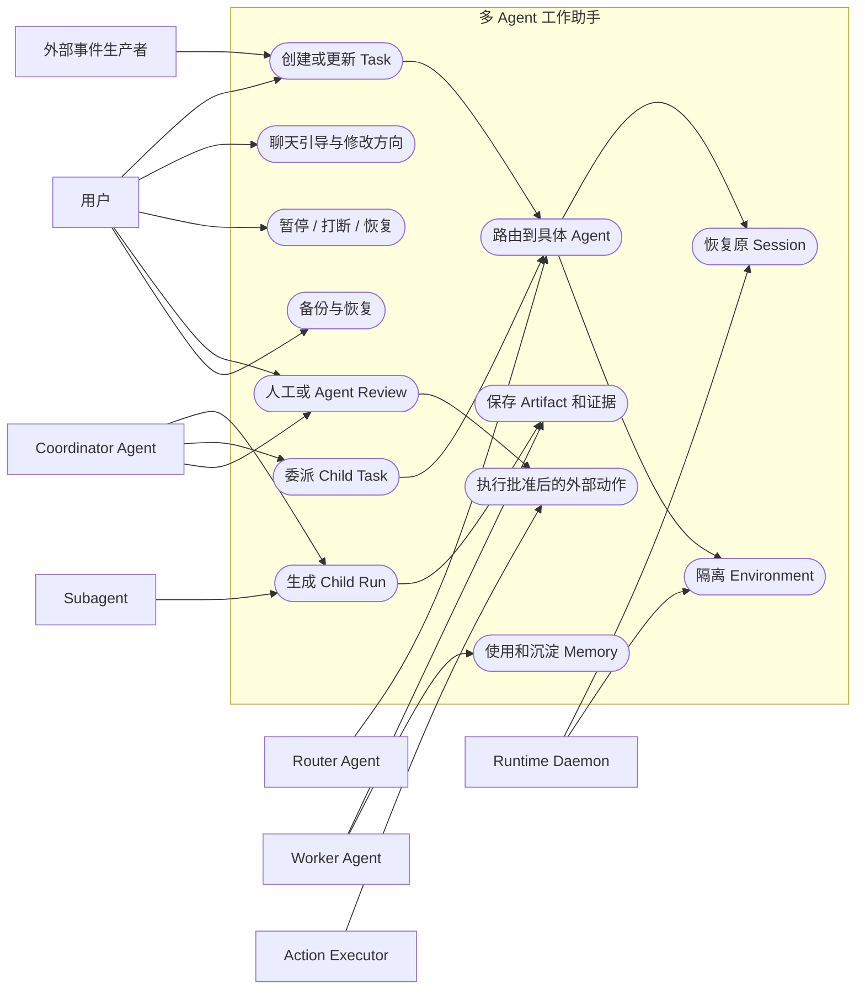
```mermaid
flowchart LR
    U[用户]
    EP[外部事件生产者]
    RA[Router Agent]
    CA[Coordinator Agent]
    WA[Worker Agent]
    SA[Subagent]
    RD[Runtime Daemon]
    AE[Action Executor]

    subgraph SYS[多 Agent 工作助手]
        UC1([创建或更新 Task])
        UC2([路由到具体 Agent])
        UC3([恢复原 Session])
        UC4([聊天引导与修改方向])
        UC5([暂停 / 打断 / 恢复])
        UC6([人工或 Agent Review])
        UC7([生成 Child Run])
        UC8([委派 Child Task])
        UC9([隔离 Environment])
        UC10([使用和沉淀 Memory])
        UC11([保存 Artifact 和证据])
        UC12([备份与恢复])
        UC13([执行批准后的外部动作])
    end

    U --> UC1
    U --> UC4
    U --> UC5
    U --> UC6
    U --> UC12
    EP --> UC1

    RA --> UC2
    CA --> UC7
    CA --> UC8
    CA --> UC6
    WA --> UC11
    WA --> UC10
    SA --> UC7
    RD --> UC3
    RD --> UC9
    AE --> UC13

    UC1 --> UC2
    UC2 --> UC3
    UC2 --> UC9
    UC7 --> UC11
    UC8 --> UC2
    UC6 --> UC13
```

### 2.1 主要 Actor

| Actor | 主要责任 |
|---|---|
| 用户 | 提出目标、补充信息、修正方向、评审和授权 |
| 外部事件生产者 | 产生任务请求或状态变化，不直接控制执行 |
| Router Agent | 选择 AgentTeam 和具体 Agent，给出可解释理由 |
| Coordinator Agent | 对 Root Task 负责，拆解工作并汇总结果 |
| Worker Agent | 独立完成 Task 或 Child Task |
| Subagent | 在 Parent Run 内完成临时、无独立责任的执行片段 |
| Runtime Daemon | 管理环境、进程、控制命令、Session 恢复和事件上报 |
| Action Executor | 在批准后实施高风险外部副作用 |

## 3. 三层工作分解模型

现有设计可以把“工作拆分”分成三个层次，不需要预先完整编排，也不需要为“小队”增加新的底层实体。

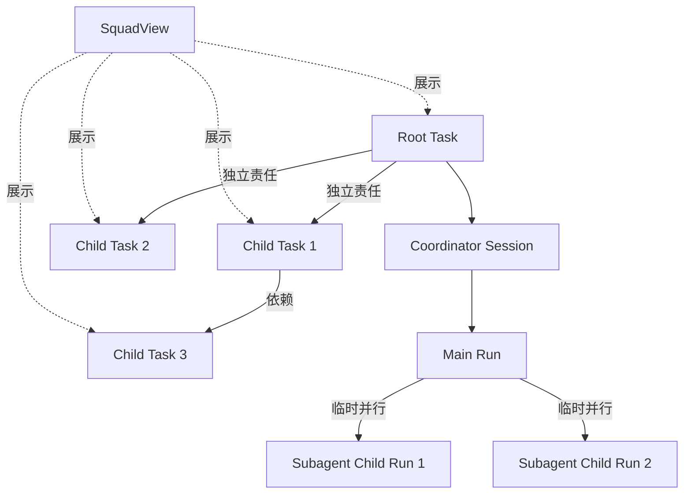
```mermaid
flowchart TB
    ROOT[Root Task]

    ROOT -->|独立责任| CT1[Child Task 1]
    ROOT -->|独立责任| CT2[Child Task 2]
    CT1 -->|依赖| CT3[Child Task 3]

    ROOT --> S[Coordinator Session]
    S --> MR[Main Run]
    MR -->|临时并行| SR1[Subagent Child Run 1]
    MR -->|临时并行| SR2[Subagent Child Run 2]

    VIEW[SquadView]
    VIEW -.展示.-> ROOT
    VIEW -.展示.-> CT1
    VIEW -.展示.-> CT2
    VIEW -.展示.-> CT3
```

### 3.1 判断树

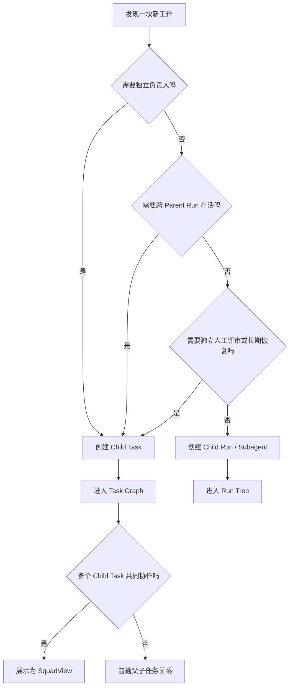
```mermaid
flowchart TD
    A[发现一块新工作] --> B{需要独立负责人吗}
    B -->|是| T[创建 Child Task]
    B -->|否| C{需要跨 Parent Run 存活吗}
    C -->|是| T
    C -->|否| D{需要独立人工评审或长期恢复吗}
    D -->|是| T
    D -->|否| R[创建 Child Run / Subagent]

    T --> G[进入 Task Graph]
    R --> RT[进入 Run Tree]

    G --> V{多个 Child Task 共同协作吗}
    V -->|是| S[展示为 SquadView]
    V -->|否| N[普通父子任务关系]
```

### 3.2 三者的边界

| 模型 | 用来表达 | 是否预编排 | 生命周期 |
|---|---|---|---|
| Workflow Template | 某类工作的可复用骨架 | 可选 | 跨 Task |
| Task Graph | 本次工作实际产生的独立任务和依赖 | 动态为主 | 跨多个 Run |
| Run Tree | 一次执行内部的 Subagent 调用 | 运行时产生 | 不超过 Parent Run |

## 4. 从事件到执行的通用时序

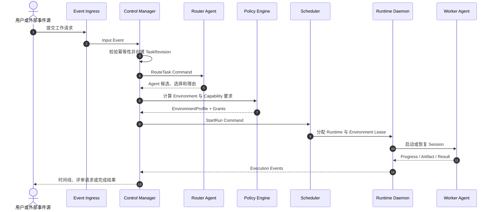
```mermaid
sequenceDiagram
    autonumber
    actor User as 用户或外部事件源
    participant Ingress as Event Ingress
    participant Manager as Control Manager
    participant Router as Router Agent
    participant Policy as Policy Engine
    participant Scheduler as Scheduler
    participant Daemon as Runtime Daemon
    participant Agent as Worker Agent

    User->>Ingress: 提交工作请求
    Ingress->>Manager: Input Event
    Manager->>Manager: 校验幂等性并创建 TaskRevision
    Manager->>Router: RouteTask Command
    Router-->>Manager: Agent 候选、选择和理由
    Manager->>Policy: 计算 Environment 与 Capability 要求
    Policy-->>Manager: EnvironmentProfile + Grants
    Manager->>Scheduler: StartRun Command
    Scheduler->>Daemon: 分配 Runtime 与 Environment Lease
    Daemon->>Agent: 启动或恢复 Session
    Agent-->>Daemon: Progress / Artifact / Result
    Daemon-->>Manager: Execution Events
    Manager-->>User: 时间线、评审请求或完成结果
```

这个时序只要求开始时知道 Root Task。Child Task 和 Child Run 可以在 Agent 工作过程中动态产生。

## 5. 场景一：已有工程问题继续由原 Agent 处理

### 5.1 场景描述

一个 Agent 曾经定位过某个检索或 SQL 回归问题，并已经掌握：

- 复现条件；
- 正确的仓库和分支关系；
- 已排除的错误方向；
- 相关测试和历史讨论。

几天后，用户又提出补充分析或 Review 修正。系统需要避免把任务随机分给另一个 Agent，造成上下文丢失。

### 5.2 预期流程

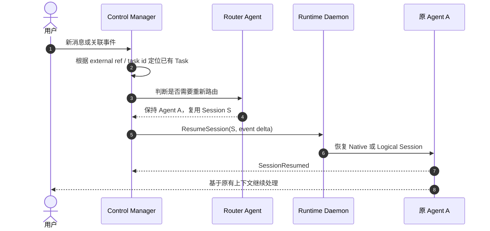
```mermaid
sequenceDiagram
    autonumber
    actor User as 用户
    participant Manager as Control Manager
    participant Router as Router Agent
    participant Daemon as Runtime Daemon
    participant AgentA as 原 Agent A

    User->>Manager: 新消息或关联事件
    Manager->>Manager: 根据 external ref / task id 定位已有 Task
    Manager->>Router: 判断是否需要重新路由
    Router-->>Manager: 保持 Agent A，复用 Session S
    Manager->>Daemon: ResumeSession(S, event delta)
    Daemon->>AgentA: 恢复 Native 或 Logical Session
    AgentA-->>Manager: SessionResumed
    AgentA-->>User: 基于原有上下文继续处理
```

### 5.3 中途改变工作边界

如果 Agent 正准备改代码，用户补充“当前只讨论原因，不修改代码”，这不是普通聊天，而是 Task 约束变化：

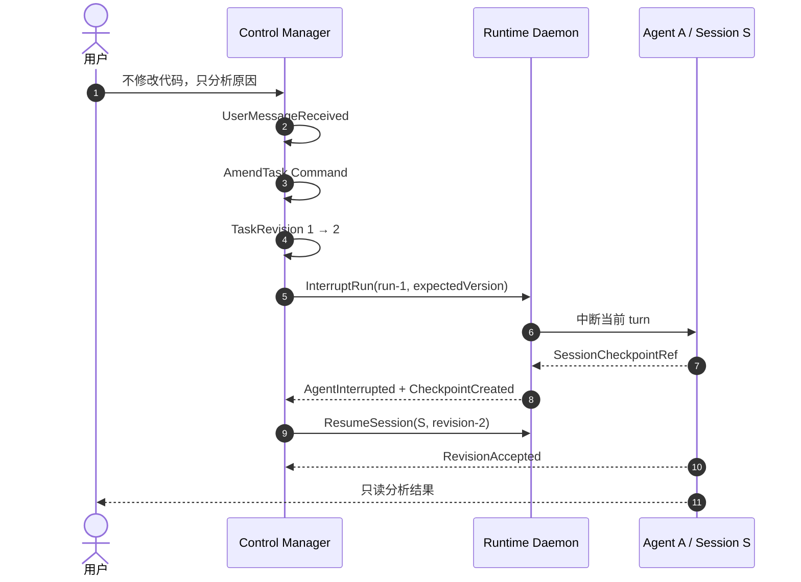
```mermaid
sequenceDiagram
    autonumber
    actor User as 用户
    participant Manager as Control Manager
    participant Daemon as Runtime Daemon
    participant Agent as Agent A / Session S

    User->>Manager: 不修改代码，只分析原因
    Manager->>Manager: UserMessageReceived
    Manager->>Manager: AmendTask Command
    Manager->>Manager: TaskRevision 1 → 2
    Manager->>Daemon: InterruptRun(run-1, expectedVersion)
    Daemon->>Agent: 中断当前 turn
    Agent-->>Daemon: SessionCheckpointRef
    Daemon-->>Manager: AgentInterrupted + CheckpointCreated
    Manager->>Daemon: ResumeSession(S, revision-2)
    Agent-->>Manager: RevisionAccepted
    Agent-->>User: 只读分析结果
```

### 5.4 验证结论

**可以满足。** 依赖条件是：

- Task 与外部对象映射可靠；
- Assignment 历史没有被覆盖；
- SessionRef 持久保存；
- Agent Adapter 至少支持“中断后恢复”的降级路径；
- Run 明确记录其使用的 TaskRevision 和之后接受的 Directive。

主要风险不在领域模型，而在不同 Agent Engine 的 Native Session 恢复能力。

## 6. 场景二：多平台构建、验证和发布包汇总

### 6.1 场景描述

一次发布需要在多个平台生成构建产物，例如：

- Linux x86_64；
- Linux arm64；
- macOS arm64；
- macOS x86_64；
- Windows x86_64。

每个平台需要不同机器和工具链，最后还要统一检查版本、架构、文件清单和校验值，并形成完整发布包。该场景来源于实际的多平台 wheel、运行包和校验清单维护工作模式。

### 6.2 动态 Task Graph

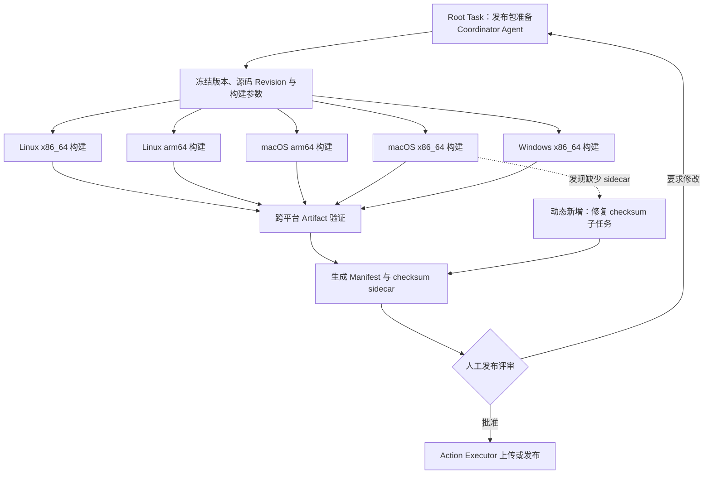
```mermaid
flowchart TB
    R[Root Task：发布包准备<br/>Coordinator Agent]

    R --> F[冻结版本、源码 Revision 与构建参数]
    F --> LX[Linux x86_64 构建]
    F --> LA[Linux arm64 构建]
    F --> MA[macOS arm64 构建]
    F --> MX[macOS x86_64 构建]
    F --> WX[Windows x86_64 构建]

    LX --> V[跨平台 Artifact 验证]
    LA --> V
    MA --> V
    MX --> V
    WX --> V

    V --> M[生成 Manifest 与 checksum sidecar]
    M --> H{人工发布评审}
    H -->|批准| P[Action Executor 上传或发布]
    H -->|要求修改| R

    MX -.发现缺少 sidecar.-> FIX[动态新增：修复 checksum 子任务]
    FIX --> M
```

图中初始骨架可以来自 Workflow Template，但“修复缺失 checksum”是执行时发现后动态加入的 Child Task。

### 6.3 路由与环境

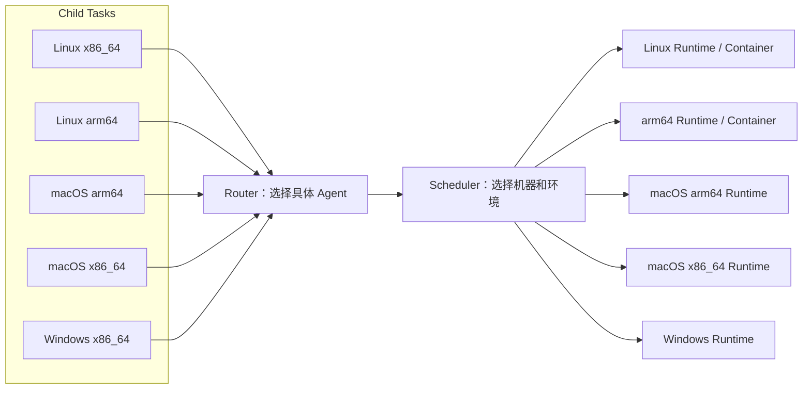
```mermaid
flowchart LR
    subgraph TASKS[Child Tasks]
        T1[Linux x86_64]
        T2[Linux arm64]
        T3[macOS arm64]
        T4[macOS x86_64]
        T5[Windows x86_64]
    end

    ROUTER[Router：选择具体 Agent]
    SCHED[Scheduler：选择机器和环境]

    T1 --> ROUTER --> SCHED
    T2 --> ROUTER
    T3 --> ROUTER
    T4 --> ROUTER
    T5 --> ROUTER

    SCHED --> R1[Linux Runtime / Container]
    SCHED --> R2[arm64 Runtime / Container]
    SCHED --> R3[macOS arm64 Runtime]
    SCHED --> R4[macOS x86_64 Runtime]
    SCHED --> R5[Windows Runtime]
```

Router 决定由哪个构建 Agent 负责；Scheduler 根据 OS、架构、工具链和资源容量选择 Runtime。不能把“Agent A”与“Linux 主机 A”绑定成同一个概念。

### 6.4 结果汇总

每个 Child Task 输出统一 Result Contract：

```text
platform
source_revision
build_parameters
artifact_refs
artifact_sizes
checksums
verification_results
warnings
unresolved_issues
```

Coordinator 不读取各机器的完整构建 transcript，只消费结构化结果、验证证据和必要日志。

### 6.5 故障分析

| 故障 | 系统行为 |
|---|---|
| 某个 Runtime 离线 | Child Task 保持负责人和 Session，等待恢复或人工迁移 |
| 某个平台构建失败 | 只重跑该 Child Task 的后续 Run |
| 产物生成但验证失败 | Child Task 进入 CHANGES_REQUESTED，不进入 fan-in |
| 产物只在远程目录 | 不视为持久交付，必须上传到权威 Artifact Store 或注册可靠备份 |
| 父 Task Revision 改变 | 检查所有 Child Task 是否基于旧 Revision，需要标 stale 或重跑 |
| 上传完成但响应丢失 | Action Executor 使用幂等键并主动核对远端结果 |

### 6.6 验证结论

**总体可以满足，但有三项必须补强：**

1. Artifact 需要 Manifest 和验证状态，不能只保存文件路径；
2. Task Graph 需要 fan-in 条件和 Child Task stale 检测；
3. 外部上传无法保证真正 exactly-once，必须具备幂等和结果对账。

这些都可以作为 Artifact、TaskRelation、Command/Event 的属性实现，不需要增加新的顶层实体。

## 7. 场景三：主 Agent 使用多个 Subagent 调研问题

### 7.1 场景描述

用户要求分析一个复杂问题。Coordinator Agent 判断需要同时进行：

- 读取源码并梳理调用路径；
- 对比不同版本行为；
- 从日志中寻找共同特征；
- 检索历史问题和已有修复。

这些工作短、临时、没有独立业务责任，不应在任务看板上创建四个 Child Task。

### 7.2 Run Tree 时序

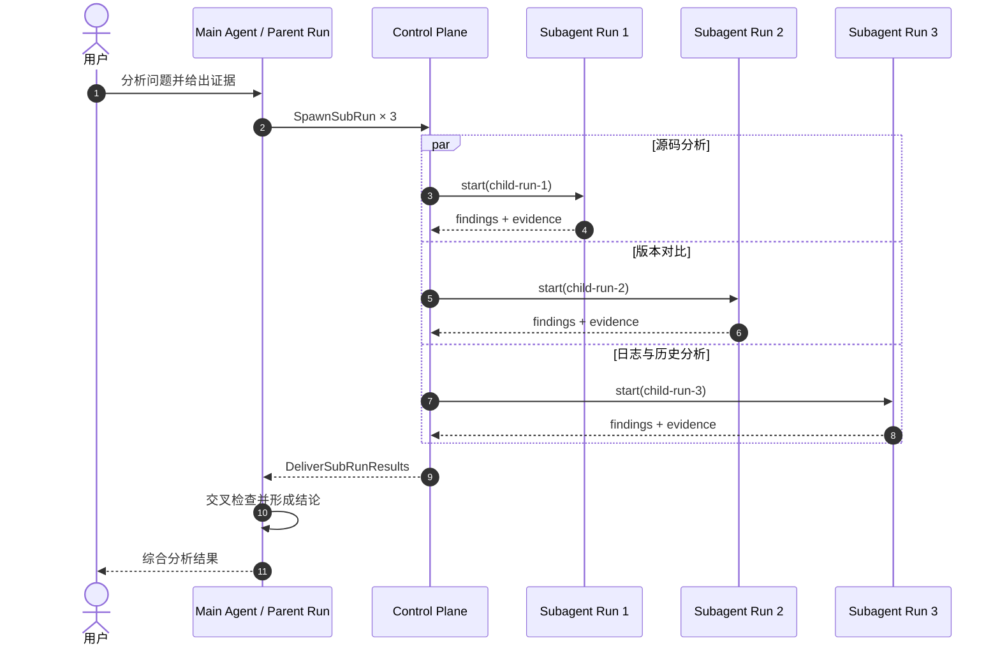
```mermaid
sequenceDiagram
    autonumber
    actor User as 用户
    participant Main as Main Agent / Parent Run
    participant Manager as Control Plane
    participant S1 as Subagent Run 1
    participant S2 as Subagent Run 2
    participant S3 as Subagent Run 3

    User->>Main: 分析问题并给出证据
    Main->>Manager: SpawnSubRun × 3
    par 源码分析
        Manager->>S1: start(child-run-1)
        S1-->>Manager: findings + evidence
    and 版本对比
        Manager->>S2: start(child-run-2)
        S2-->>Manager: findings + evidence
    and 日志与历史分析
        Manager->>S3: start(child-run-3)
        S3-->>Manager: findings + evidence
    end
    Manager-->>Main: DeliverSubRunResults
    Main->>Main: 交叉检查并形成结论
    Main-->>User: 综合分析结果
```

Subagent 可以由 Agent Engine 原生启动，也可以由 Scheduler 选择其他模型或 Runtime。控制面统一记录为 Child Run。

### 7.3 执行中升级为 Child Task

如果 Subagent 发现需要运行数小时的复现实验：

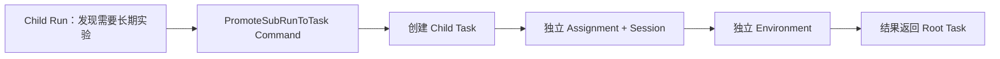
```mermaid
flowchart LR
    SR[Child Run：发现需要长期实验]
    SR --> C[PromoteSubRunToTask Command]
    C --> T[创建 Child Task]
    T --> A[独立 Assignment + Session]
    A --> E[独立 Environment]
    E --> RES[结果返回 Root Task]
```

已有 Subagent 结果作为 Child Task 的输入 Artifact，而不是丢弃后重来。

### 7.4 控制与隔离

- 只读 Subagent 可以共享 Parent Environment 的只读视图；
- 并行写入必须使用独立 overlay/worktree；
- Child Run 的 Capability 是 Parent Run 的子集；
- 打断 Parent Run 时，Required Child Run 默认级联取消；
- 用户可以针对 Root Run 打断，也可以在可寻址时取消某个 Child Run；
- Subagent 结果进入 Parent Session，Subagent 不自动获得长期 Session Memory。

### 7.5 验证结论

**可以满足，并且不需要 Subagent 成为新实体。** `Run.parent_run_id`、join policy、预算与级联取消即可覆盖。

实际限制是：部分 Agent Engine 不暴露原生 Subagent 的独立控制和日志。此时可以只记录嵌套 execution span，或者改用平台托管 Child Run。

## 8. 场景四：周期性创建和维护工作周报

### 8.1 场景描述

每周需要根据既有模板创建工作周报：

- 找到正确模板；
- 读取模板正文和目录位置；
- 按现有命名规范创建文档；
- 放在正确层级；
- 用户可以修正文档位置或命名；
- 成功流程沉淀为下周可复用的知识或 Skill。

这是非代码任务，验证 Task、Resource、Artifact、Memory 和外部副作用是否脱离 Git 仓库仍然成立。

### 8.2 资源模型

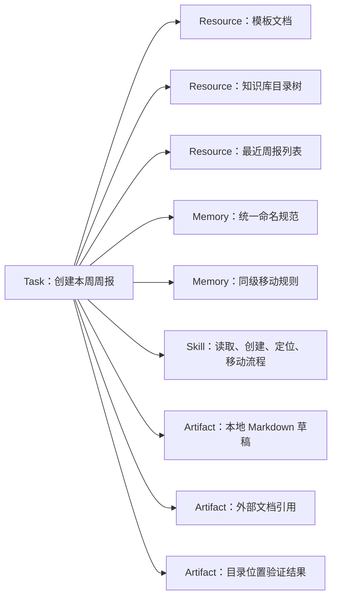
```mermaid
flowchart LR
    T[Task：创建本周周报]
    T --> R1[Resource：模板文档]
    T --> R2[Resource：知识库目录树]
    T --> R3[Resource：最近周报列表]
    T --> M1[Memory：统一命名规范]
    T --> M2[Memory：同级移动规则]
    T --> SK[Skill：读取、创建、定位、移动流程]

    T --> A1[Artifact：本地 Markdown 草稿]
    T --> A2[Artifact：外部文档引用]
    T --> A3[Artifact：目录位置验证结果]
```

### 8.3 首次执行与纠正

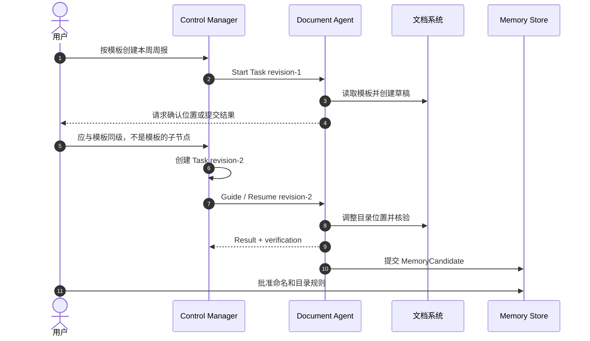
```mermaid
sequenceDiagram
    autonumber
    actor User as 用户
    participant Manager as Control Manager
    participant Agent as Document Agent
    participant External as 文档系统
    participant Memory as Memory Store

    User->>Manager: 按模板创建本周周报
    Manager->>Agent: Start Task revision-1
    Agent->>External: 读取模板并创建草稿
    Agent-->>User: 请求确认位置或提交结果
    User->>Manager: 应与模板同级，不是模板的子节点
    Manager->>Manager: 创建 Task revision-2
    Manager->>Agent: Guide / Resume revision-2
    Agent->>External: 调整目录位置并核验
    Agent-->>Manager: Result + verification
    Agent->>Memory: 提交 MemoryCandidate
    User->>Memory: 批准命名和目录规则
```

### 8.4 下周执行

下周触发的是新 Task，因为目标日期和交付对象不同；Router 可以基于历史归属继续选择同一个 Document Agent，但应创建新的 Task Session。长期 Resource/Team Memory 和 Skill 可以复用。

这正好区分：

```text
同一个 Task 的继续工作：复用原 Session
相似但新的周期任务：新 Session，复用长期 Memory / Skill
```

### 8.5 外部副作用

创建和移动外部文档属于可撤销但真实的外部修改，需要：

- 明确 External Resource；
- 幂等键或执行前查询；
- 保存修改前后引用；
- 操作后读回验证；
- 高风险时先产出草稿并 Review。

### 8.6 验证结论

**可以满足。** 该场景说明架构并不依赖代码仓库。

需要补强的是外部系统写入的统一 Effect/Action Contract，否则不同 Connector 会各自实现一套不可审计的“写成功”定义。

## 9. 场景五：问题修复完成后回合并到发布分支

### 9.1 场景描述

一个问题已经完成定位、修复和主分支验证，用户随后要求把修复带入发布分支。这个新工作与原问题高度相关，但有独立风险、环境和验收条件。

推荐建模为一个新的 Follow-up Task，而不是继续修改原 Root Task：

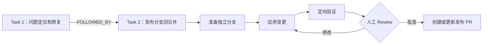
```mermaid
flowchart LR
    T1[Task 1：问题定位和修复]
    T1 -->|FOLLOWED_BY| T2[Task 2：发布分支回合并]
    T2 --> B[准备独立分支]
    B --> C[应用变更]
    C --> V[定向验证]
    V --> R{人工 Review}
    R -->|批准| PR[创建或更新发布 PR]
    R -->|修改| C
```

### 9.2 为什么是新 Task

- 发布分支基线不同；
- 可能需要新的 Environment；
- 验收标准不同；
- 外部副作用和审批策略不同；
- 原修复任务已经形成稳定完成记录。

Router 可以优先选择原 Agent，因为它有最强的领域上下文，但新 Task 默认建立新 Logical Session，并通过 Artifact、Memory 和 TaskRelation 获取必要背景。

### 9.3 Review 与 Capability

Agent 可以自动准备分支、应用变更并运行本地验证，但“推送、创建 PR、合并”应根据 Policy 分别授权：

```text
prepare_change       默认允许
push_branch          任务级 Grant
create_pull_request  任务级 Grant
merge_release        人工 Decision 后短期 Grant
```

正式批准必须绑定：

- 发布 TaskRevision；
- 目标分支当前 Revision；
- 待提交 Artifact/commit；
- 验证结果；
- 授权动作范围。

### 9.4 验证结论

**可以满足。** TaskRelation、历史路由亲和性、独立 Environment 和 version-bound Review 足够表达该场景。

需要注意：相关新 Task 不应盲目恢复旧 Native Session；旧 Session 可能绑定旧工作目录和旧分支。应由 Agent 使用新 Session 消费经过筛选的历史上下文。

## 10. 场景六：Runtime 离线、暂停和跨机器恢复

### 10.1 场景描述

Agent A 正在机器 M1 上工作。机器突然离线，或者用户主动暂停，希望稍后在原机器或另一台机器继续。

### 10.2 恢复决策

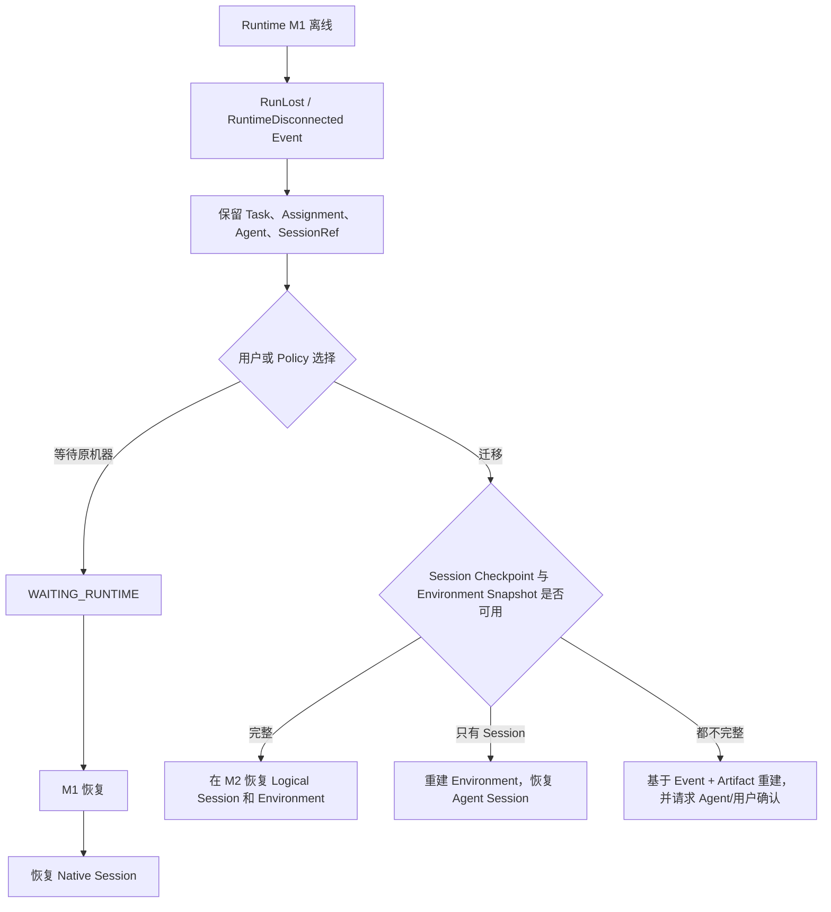
```mermaid
flowchart TD
    L[Runtime M1 离线] --> R[RunLost / RuntimeDisconnected Event]
    R --> K[保留 Task、Assignment、Agent、SessionRef]
    K --> C{用户或 Policy 选择}

    C -->|等待原机器| W[WAITING_RUNTIME]
    W --> O[M1 恢复]
    O --> NS[恢复 Native Session]

    C -->|迁移| H{Session Checkpoint 与 Environment Snapshot 是否可用}
    H -->|完整| M[在 M2 恢复 Logical Session 和 Environment]
    H -->|只有 Session| RE[重建 Environment，恢复 Agent Session]
    H -->|都不完整| E[基于 Event + Artifact 重建，并请求 Agent/用户确认]
```

### 10.3 能保证什么

- Task、Revision、Assignment 和公开 Event 不丢；
- 原 Agent 仍然是负责人；
- 原 Runtime 恢复后可以尝试 Native Session；
- 有 Checkpoint 时可以在另一 Runtime 恢复 Logical Session；
- 不能假装不同 Provider/Model 拥有完全相同的内部上下文。

### 10.4 不能天然保证什么

- 所有 Agent Engine 都支持 Native Session 导出；
- 远程机器上的未上传文件一定可恢复；
- Session Checkpoint 与 Environment Snapshot 天然处于同一个一致时点；
- 一个模型迁移到另一个模型后行为完全一致。

### 10.5 验证结论

**部分满足，有明确前提。** Logical Session 的连续性可以保证，但无损 Native Session 跨机器迁移取决于 Agent Adapter。

必须实现：

- Checkpoint 协议；
- Runtime Artifact 上传策略；
- Environment Snapshot 或可重建声明；
- Session export capability 标记；
- 恢复后 Agent 确认现场的步骤。

## 11. 场景七：Multica 需求从设计评审到合并关闭

### 11.1 场景中的对象映射

这个场景不是一条很长的单任务流水线，而是一个逐步生长的 Task Graph，内部包含多轮 Review Run：

| 场景概念 | 架构映射 |
|---|---|
| Multica 需求工单 | 外部 Work Item；通过 ExternalReference 关联 Root Requirement Task |
| 需求负责人 | Root Task 当前 Assignment 指向的具体 Coordinator Agent |
| 设计评审文档 | 带 revision/hash 的 Design Artifact |
| 设计评审 Agent | 独立 Review Task 的具体 Agent；多轮评审复用同一 Session |
| 人工设计评审 | ReviewRequest、ReviewFinding 与 version-bound Decision |
| 子工单 | 外部 Child Work Item；一对一关联一个 Implementation Child Task |
| 开发 Agent | Child Task 当前 Assignment 指向的具体 Agent |
| PR | 外部 Artifact/ExternalReference；评审对象是明确的 commit SHA |
| 代码、安全、测试评审 | 不同 review_role 的 Review Task 与 ReviewGate |
| 评论、修改、回复 | Event；必要时形成 Directive、Finding 状态变化或新的 Artifact revision |
| 合并 | 经过授权的 External Action，最终以远端 Merge Event 为准 |
| 关闭需求 | CompletionPolicy 汇合所有必需 Child Task 后触发 Root Acceptance Gate |

这里的“其他几个 Agent 来评审”具有独立责任、多轮 Session、状态和结论，因此应建成持久的 **Review Task**，而不是 Root Run 里的临时 Subagent。只有一次性、无需独立追踪的辅助检查，才适合放进 Run Tree。

### 11.2 端到端业务流程

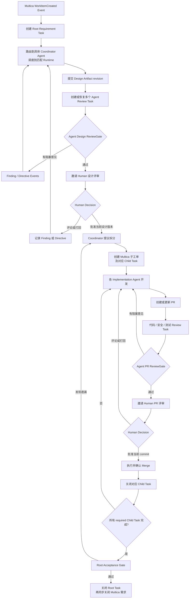
```mermaid
flowchart TD
    E[Multica WorkItemCreated Event] --> T[创建 Root Requirement Task]
    T --> C[路由到具体 Coordinator Agent<br/>调度到匹配 Runtime]
    C --> D[提交 Design Artifact revision]
    D --> AR[创建或恢复多个 Agent Review Task]
    AR --> AG{Agent Design ReviewGate}
    AG -->|有阻塞意见| DF[Finding / Directive Events]
    DF --> C
    AG -->|通过| HR[邀请 Human 设计评审]
    HR --> HG{Human Decision}
    HG -->|评论或打回| HD[记录 Finding 或 Directive]
    HD --> C
    HG -->|批准当前设计版本| DEC[Coordinator 提议拆分]
    DEC --> CT[创建 Multica 子工单<br/>及对应 Child Task]
    CT --> DEV[各 Implementation Agent 开发]
    DEV --> PR[创建或更新 PR]
    PR --> RR[代码 / 安全 / 测试 Review Task]
    RR --> RG{Agent PR ReviewGate}
    RG -->|有阻塞意见| DEV
    RG -->|通过| HPR[邀请 Human PR 评审]
    HPR --> HPG{Human Decision}
    HPG -->|评论或打回| DEV
    HPG -->|批准当前 commit| M[执行并确认 Merge]
    M --> CL[关闭对应 Child Task]
    CL --> ALL{所有 required Child Task 完成?}
    ALL -->|否| DEV
    ALL -->|是| ACC[Root Acceptance Gate]
    ACC -->|发现遗漏| DEC
    ACC -->|通过| CR[关闭 Root Task<br/>再同步关闭 Multica 需求]
```

这条流程包含三个不同的循环，不能混成一个状态：

1. 设计作者 Agent 与设计评审 Agent 的循环；
2. 设计作者 Agent 与人的循环；
3. 每个实现 Agent 与机器/人工 PR Reviewer 的循环。

每一次循环都复用原 Task、原负责人和原 Logical Session；Artifact 或 commit 发生变化时创建新 revision，并启动新的 Run。

### 11.3 动态 Task Graph

Task Graph 不需要在需求进入时预先编排。开始时只有 Root Task；设计通过后才产生 Implementation Child Task；PR 出现后才产生对应的 Review Task。

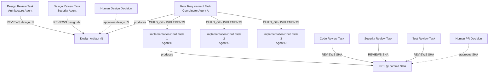
```mermaid
flowchart TB
    R[Root Requirement Task<br/>Coordinator Agent A]
    D[Design Artifact rN]
    DR1[Design Review Task<br/>Architecture Agent]
    DR2[Design Review Task<br/>Security Agent]
    DH[Human Design Decision]

    I1[Implementation Child Task 1<br/>Agent B]
    I2[Implementation Child Task 2<br/>Agent C]
    I3[Implementation Child Task 3<br/>Agent D]

    P1[PR 1 @ commit SHA]
    CR1[Code Review Task]
    SR1[Security Review Task]
    TR1[Test Review Task]
    PH1[Human PR Decision]

    R -->|produces| D
    DR1 -->|REVIEWS design rN| D
    DR2 -->|REVIEWS design rN| D
    DH -.approves design rN.-> D

    R -->|CHILD_OF / IMPLEMENTS| I1
    R -->|CHILD_OF / IMPLEMENTS| I2
    R -->|CHILD_OF / IMPLEMENTS| I3

    I1 -->|produces| P1
    CR1 -->|REVIEWS SHA| P1
    SR1 -->|REVIEWS SHA| P1
    TR1 -->|REVIEWS SHA| P1
    PH1 -.approves SHA.-> P1
```

图中只展开了 Child Task 1 的 PR 评审子图；其他 Child Task 使用相同结构。由此派生出的“需求交付小队”仍然只是 SquadView：Root Coordinator、实现 Agent、评审 Agent 和人的组合视图，不需要增加新的执行实体。

### 11.4 设计评审的多轮时序

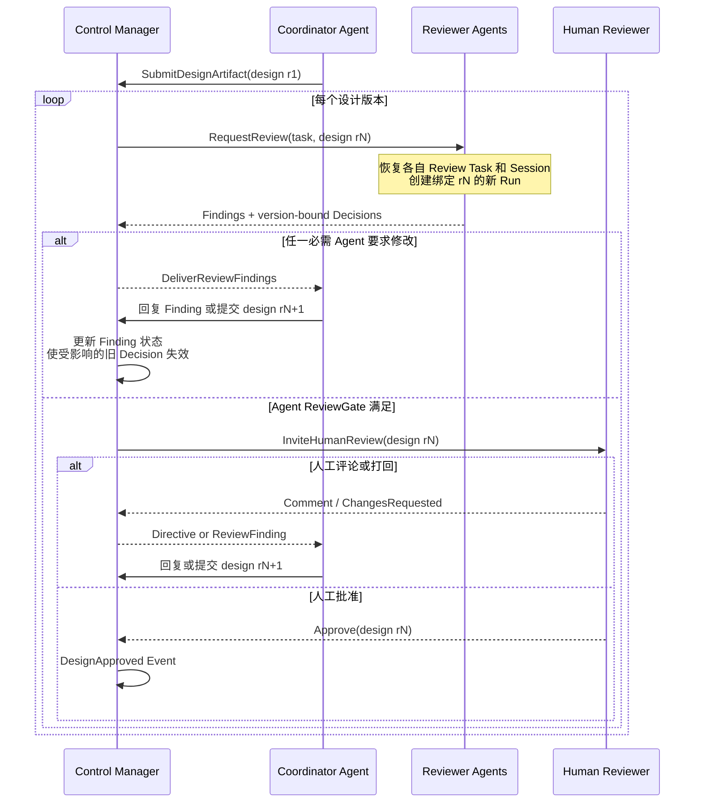
```mermaid
sequenceDiagram
    participant M as Control Manager
    participant A as Coordinator Agent
    participant R as Reviewer Agents
    participant H as Human Reviewer

    A->>M: SubmitDesignArtifact(design r1)
    loop 每个设计版本
        M->>R: RequestReview(task, design rN)
        Note over R: 恢复各自 Review Task 和 Session<br/>创建绑定 rN 的新 Run
        R-->>M: Findings + version-bound Decisions
        alt 任一必需 Agent 要求修改
            M-->>A: DeliverReviewFindings
            A->>M: 回复 Finding 或提交 design rN+1
            M->>M: 更新 Finding 状态<br/>使受影响的旧 Decision 失效
        else Agent ReviewGate 满足
            M->>H: InviteHumanReview(design rN)
            alt 人工评论或打回
                H-->>M: Comment / ChangesRequested
                M-->>A: Directive or ReviewFinding
                A->>M: 回复或提交 design rN+1
            else 人工批准
                H-->>M: Approve(design rN)
                M->>M: DesignApproved Event
            end
        end
    end
```

设计评审阶段需要区分四件事：

- Review Task：由谁负责某类评审，跨多轮存在；
- Review Run：Reviewer 针对某个设计版本执行的一轮工作；
- ReviewFinding：可单独回复、修复、关闭或接受风险的意见；
- ReviewDecision：Reviewer 对某个精确版本的结论。

聊天可以承载讨论，但不能代替结构化的 Finding 和最终 Decision。

### 11.5 从需求拆分到 Multica 子工单

设计通过后，Coordinator Agent 不是直接篡改数据库或调用 Multica，而是发出带预期结构的 Command：

```text
ProposeTaskGraphChange
├── parent_task_id
├── based_on_task_revision_id
├── based_on_design_artifact_revision
└── proposed_children[]
    ├── title / objective / acceptance_criteria
    ├── dependencies
    ├── required
    ├── routing_hint
    └── capability_ceiling
```

Manager 校验后，为每个提案创建 canonical Child Task，再通过 Action Executor 创建 Multica 子工单。Multica 随后回传的 `WorkItemCreated` 事件必须通过 correlation key 绑定已经存在的 Child Task，而不能再创建一份重复 Task。

因此一对一关系应是：

```text
Multica child_work_item_id
        ↕ ExternalReference
canonical implementation_task_id
```

“一个子工单对应一个 Agent 任务”可以作为该数据源的策略，但 Task 的负责人仍通过 Assignment 管理：任一时刻只有一个具体 Agent，故障转移或人工改派时保留完整 Assignment 历史。

### 11.6 PR 评审与修复循环

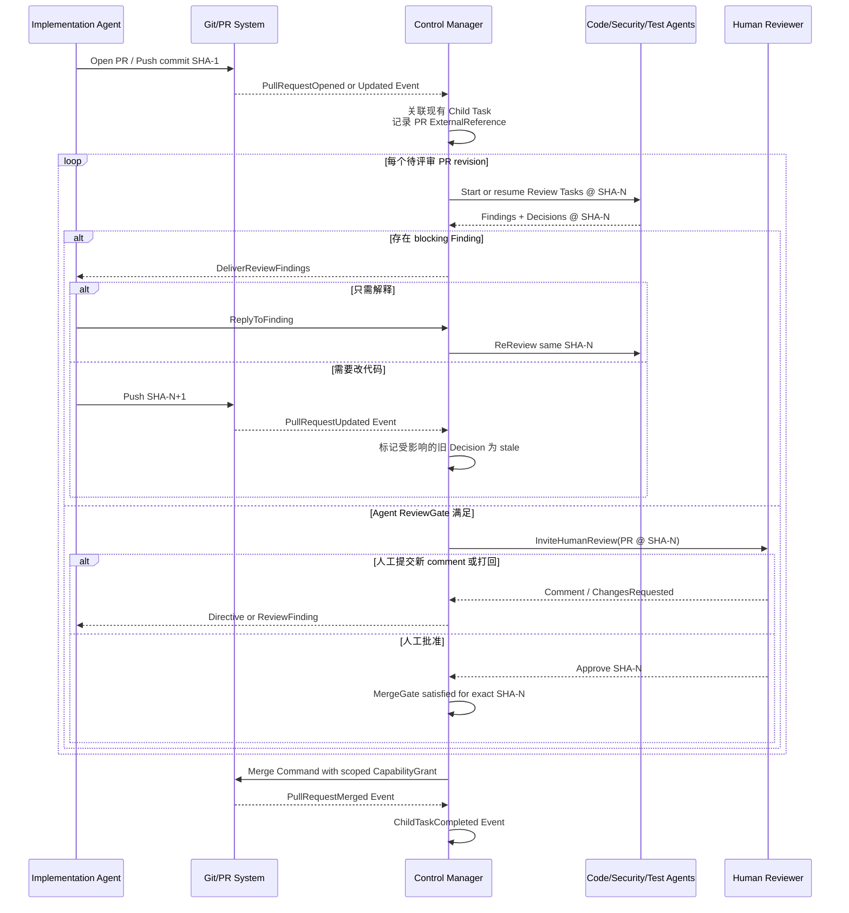
```mermaid
sequenceDiagram
    participant W as Implementation Agent
    participant G as Git/PR System
    participant M as Control Manager
    participant R as Code/Security/Test Agents
    participant H as Human Reviewer

    W->>G: Open PR / Push commit SHA-1
    G-->>M: PullRequestOpened or Updated Event
    M->>M: 关联现有 Child Task<br/>记录 PR ExternalReference

    loop 每个待评审 PR revision
        M->>R: Start or resume Review Tasks @ SHA-N
        R-->>M: Findings + Decisions @ SHA-N
        alt 存在 blocking Finding
            M-->>W: DeliverReviewFindings
            alt 只需解释
                W->>M: ReplyToFinding
                M->>R: ReReview same SHA-N
            else 需要改代码
                W->>G: Push SHA-N+1
                G-->>M: PullRequestUpdated Event
                M->>M: 标记受影响的旧 Decision 为 stale
            end
        else Agent ReviewGate 满足
            M->>H: InviteHumanReview(PR @ SHA-N)
            alt 人工提交新 comment 或打回
                H-->>M: Comment / ChangesRequested
                M-->>W: Directive or ReviewFinding
            else 人工批准
                H-->>M: Approve SHA-N
                M->>M: MergeGate satisfied for exact SHA-N
            end
        end
    end

    M->>G: Merge Command with scoped CapabilityGrant
    G-->>M: PullRequestMerged Event
    M->>M: ChildTaskCompleted Event
```

这里有几个必须写进协议的不变量：

1. `PullRequestOpened` 必须关联现有 Implementation Task，不能因为 Git 平台又来一个事件而生成重复任务。
2. Review 的 subject 是具体 commit SHA，不是模糊的“这个 PR”。
3. 同一 review_role 默认复用原 Review Task、Reviewer Agent 和 Logical Session；新一轮只创建新 Run。
4. 推送新 commit 后，受影响的旧批准必须失效或进入 `STALE`；纯回复可以在同一 SHA 上继续评审。
5. Code、Security、Test 等角色的必需性、通过条件和 quorum 由 ReviewGate Policy 决定。
6. Policy 要支持职责分离，例如安全 Reviewer 不得与实现者是同一个 Agent。
7. 人工沉默不能推导为批准；Merge 必须绑定人的明确 Decision 和准确 SHA。
8. `Merge Command` 只是意图；只有观察到远端 `PullRequestMerged Event` 才能关闭 Child Task。

### 11.7 Finding 生命周期

如果所有意见都只是聊天消息，几轮以后系统无法回答“还有哪些阻塞项没有解决”。ReviewFinding 至少需要以下状态：

```text
OPEN
├── REPLIED
├── FIXED_PENDING_REVIEW
├── RESOLVED
├── ACCEPTED_RISK
├── REJECTED
└── OUTDATED
```

每条 Finding 需要绑定：

- review_role 与 reviewer；
- 被评审的 Artifact revision 或 commit SHA；
- 严重程度与是否 blocking；
- 讨论线程；
- 解决它的回复或新 revision；
- 最终关闭者和 Decision。

这样 Agent 回答问题、修改代码和 Reviewer 确认修复才是可审计的闭环。

### 11.8 Root Task 与 Child Task 状态

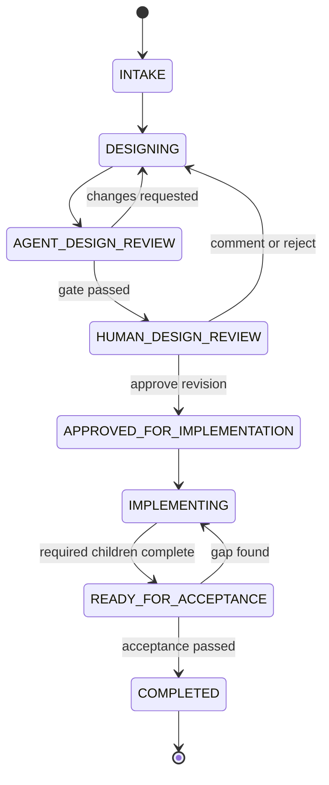
```mermaid
stateDiagram-v2
    [*] --> INTAKE
    INTAKE --> DESIGNING
    DESIGNING --> AGENT_DESIGN_REVIEW
    AGENT_DESIGN_REVIEW --> DESIGNING: changes requested
    AGENT_DESIGN_REVIEW --> HUMAN_DESIGN_REVIEW: gate passed
    HUMAN_DESIGN_REVIEW --> DESIGNING: comment or reject
    HUMAN_DESIGN_REVIEW --> APPROVED_FOR_IMPLEMENTATION: approve revision
    APPROVED_FOR_IMPLEMENTATION --> IMPLEMENTING
    IMPLEMENTING --> READY_FOR_ACCEPTANCE: required children complete
    READY_FOR_ACCEPTANCE --> IMPLEMENTING: gap found
    READY_FOR_ACCEPTANCE --> COMPLETED: acceptance passed
    COMPLETED --> [*]
```

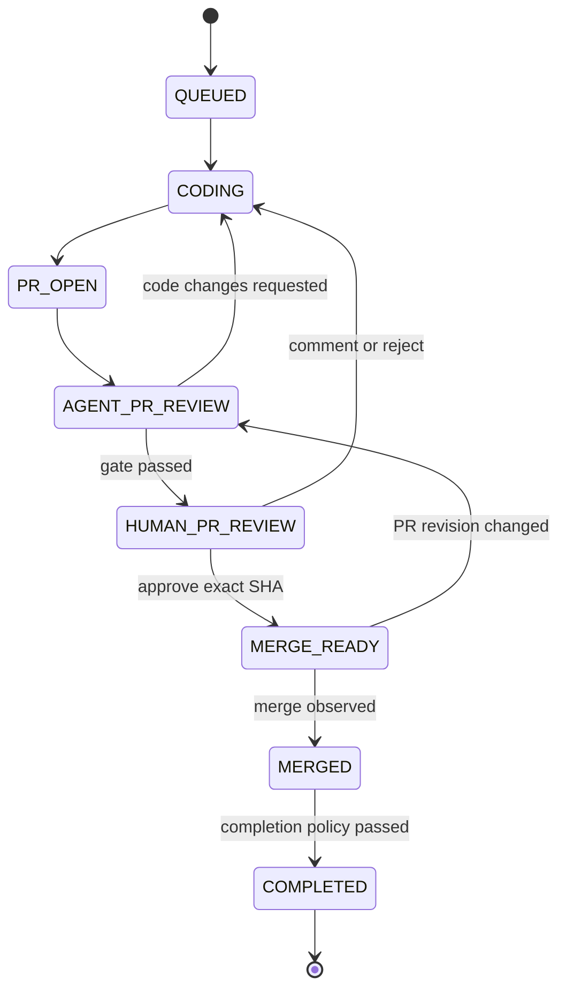
```mermaid
stateDiagram-v2
    [*] --> QUEUED
    QUEUED --> CODING
    CODING --> PR_OPEN
    PR_OPEN --> AGENT_PR_REVIEW
    AGENT_PR_REVIEW --> CODING: code changes requested
    AGENT_PR_REVIEW --> HUMAN_PR_REVIEW: gate passed
    HUMAN_PR_REVIEW --> CODING: comment or reject
    HUMAN_PR_REVIEW --> MERGE_READY: approve exact SHA
    MERGE_READY --> AGENT_PR_REVIEW: PR revision changed
    MERGE_READY --> MERGED: merge observed
    MERGED --> COMPLETED: completion policy passed
    COMPLETED --> [*]
```

状态名是看板投影，不必都成为新的领域对象。真正的依据仍然是 Event、Review Decision、Artifact revision 和依赖状态。

### 11.9 父需求关闭的汇合规则

“所有关联任务关闭后，需求工单可以关闭”应该解释为 **获得关闭资格**，而不是无条件自动关闭。否则可能出现三个子 PR 都已合并，但集成验收失败或仍有未解决需求的问题。

```mermaid
flowchart LR
    C1[Required Child 1 completed] --> J{Root CompletionPolicy}
    C2[Required Child 2 completed] --> J
    C3[Required Child 3 completed] --> J
    F[No blocking Findings] --> J
    V[Merge and test evidence verified] --> J
    O[Optional children resolved or waived] --> J

    J -->|不满足| W[Root remains IMPLEMENTING]
    J -->|满足| E[ParentClosureEligible Event]
    E --> A[Coordinator / Human Acceptance]
    A -->|发现遗漏| N[创建或重开 Child Task]
    A -->|通过| C[RootTaskCompleted Event]
    C --> X[Close Multica Work Item Action]
    X --> Y[Observed remote Closed Event]
```

推荐的 Root CompletionPolicy 至少检查：

- 所有 `required=true` 的实现 Child Task 成功完成；
- 所有阻塞 Finding 已解决或由有权限的人接受风险；
- 所有要求合并的 PR 已在远端确认合并；
- 根需求的验收标准和必要集成测试已有证据；
- 可选或取消的子任务存在明确的 waive/cancel Decision；
- 若策略要求，存在 Root 级人工验收 Decision。

### 11.10 覆盖与需要补强的地方

| 业务步骤 | 当前抽象是否能表达 | 需要的约束 |
|---|---|---|
| Multica 新工单创建 Root Task | 可以 | 输入 Event 去重与 ExternalReference |
| 路由到某机器上的具体 Agent | 可以 | Router 选人、Scheduler 选机器 |
| Agent 产出设计文档 | 可以 | Artifact revision/hash |
| 多个 Agent 多轮设计评审 | 可以 | 持久 Review Task、Finding、ReviewGate |
| 邀请人并多轮设计讨论 | 可以 | Human Decision 与当前设计版本绑定 |
| 动态拆分 Multica 子工单 | 可以 | GraphChange Command 与外部动作对账 |
| 一个子工单对应一个开发任务 | 可以 | 一对一 ExternalReference 策略 |
| PR 自动触发多角色评审 | 可以 | PR 与既有 Child Task 相关联 |
| Agent 修复或回复后重新评审 | 可以 | Finding 生命周期与同 Session 新 Run |
| 人工批准或打回 | 可以 | 明确 Decision，不能从聊天沉默推断 |
| 合并后关闭 Child Task | 可以 | Merge Event 和完成策略 |
| 全部子任务完成后关闭需求 | 可以 | fan-in 后先进入 Root Acceptance Gate |

**结论：该场景可以由当前核心模型完整表达，不需要新增“一等公民”。** 它同时验证了 Task Graph、持久 Review Task、多轮 Run、version-bound Decision、ExternalReference、动态 fan-out/fan-in 和人在回路。

需要补充的主要是 Review 协议、外部对象关联和关闭策略，而不是再增加一个“项目”“流程实例”或“小队”实体。

其中 Review Task 只是 `task_kind=REVIEW` 的普通 Task；ReviewFinding、ReviewGate 和 ExternalReference 是 Task/Review 下的记录或投影。它们都不会被单独路由执行，也没有自己的 Agent、Session 和 Environment，因此不升级为新的顶层聚合。

## 12. 环境、记忆和权限隔离分析

```mermaid
flowchart TB
    CP[Control Plane]

    subgraph A[Task A 边界]
        SA[Session A 私有记忆]
        EA[Environment A]
        RA[Resource A]
        GA[Capability Grants A]
    end

    subgraph B[Task B 边界]
        SB[Session B 私有记忆]
        EB[Environment B]
        RB[Resource B]
        GB[Capability Grants B]
    end

    SM[授权共享 Memory]
    AS[权威 Artifact Store]

    CP --> A
    CP --> B
    SM -->|scope 允许| SA
    SM -->|scope 允许| SB
    EA --> AS
    EB --> AS

    SA -.不可直接读取.-> SB
    EA -.不可共享写目录.-> EB
    GA -.不能转授更高权限.-> GB
```

### 12.1 必须成立的边界

1. Agent Session Memory 私有，只有 Agent 主动发布的内容进入共享 Memory。
2. 不同 Task 默认使用不同可写 Environment。
3. Task B 不能读取 Task A 的私有 Session、临时文件或 Secret。
4. Agent/Child Task/Subagent 都不能通过委派扩大 Capability。
5. 共享 Memory 和 Resource 必须经过 scope 与 sensitivity 校验。
6. Durable Artifact 必须离开临时 Runtime 工作目录，进入可备份存储。

## 13. 跨场景覆盖矩阵

| 需求 | 工程续接 | 多平台发布 | Subagent 调研 | 周报 | 发布回合并 | 故障恢复 | 完整需求交付 | 结论 |
|---|---:|---:|---:|---:|---:|---:|---:|---|
| 保持具体负责人 | ✓ | ✓ | ✓ | ✓ | ✓ | ✓ | ✓ | 满足 |
| 恢复原 Session | ✓ | 部分 | ✓ | 不适用 | 新 Session 更合理 | 有前提 | ✓ | 有前提 |
| 动态 Task Graph | 可选 | ✓ | 升级时 | 不需要 | ✓ | 不需要 | ✓ | 满足 |
| Run Tree / Subagent | 可选 | 可选 | ✓ | 可选 | 可选 | 可恢复 | 可选 | 满足 |
| 人工中途修正 | ✓ | ✓ | ✓ | ✓ | ✓ | ✓ | ✓ | 满足 |
| 多机器和多模型 | 可选 | ✓ | ✓ | 可选 | 可选 | ✓ | ✓ | 满足 |
| Environment 隔离 | ✓ | ✓ | ✓ | ✓ | ✓ | ✓ | ✓ | 需实现 Provider |
| 长期 Memory | ✓ | ✓ | ✓ | ✓ | ✓ | ✓ | ✓ | 需治理 |
| Artifact 与证据 | ✓ | ✓ | ✓ | ✓ | ✓ | ✓ | ✓ | 需 Manifest |
| 外部副作用控制 | 可选 | ✓ | 可选 | ✓ | ✓ | 不适用 | ✓ | 需统一 Action Contract |
| 多轮机器/人工评审 | 可选 | 可选 | 可选 | ✓ | ✓ | 不适用 | ✓ | 需 Review Protocol |
| 备份和恢复 | ✓ | ✓ | ✓ | ✓ | ✓ | ✓ | ✓ | Session 迁移有前提 |

## 14. 当前设计能够满足的内容

领域模型已经能够表达：

- Task 从单节点动态长成 Task Graph；
- 同一个 Task 内部动态生成 Run Tree；
- Root Agent 保持最终责任；
- Agent 对 Child Task 进行 Review；
- 用户中途修改要求并创建新 TaskRevision；
- Router 保持已有任务的 Agent/Session 亲和性；
- Scheduler 将同一个 Agent 调度到不同 Runtime 或模型；
- 代码、文档、远程操作等不同 Resource；
- Session 私有记忆和长期共享 Memory 的边界；
- 独立 Environment 和不可越权的 Capability；
- 通过 Event、Artifact、Checkpoint 完成审计和恢复。
- 从外部需求、设计评审、子工单、PR 多角色评审一直闭环到父需求验收关闭。

不需要再增加 Squad、Subagent 或 WaitCondition 作为新的底层聚合。

## 15. 当前设计仍有前提或缺口

### 15.1 Native Session 可移植性

架构只能保证 Logical Session 连续，不能保证所有 Agent Engine 的内部 Session 无损迁移。需要 Adapter 明确声明能力和降级行为。

### 15.2 外部副作用的真实结果

网络请求超时不等于动作没有发生。发布、上传、创建文档、发消息等操作必须支持：

- idempotency key；
- 执行后查询；
- 本地期望状态与远端实际状态对账；
- 不确定状态 `UNKNOWN_EFFECT`；
- 人工处理入口。

### 15.3 跨组件 Checkpoint 一致性

Session Checkpoint、Environment Snapshot 和 Event sequence 来自不同组件，需要协议化的“安全点”流程，否则恢复时可能出现 Agent 认为文件已修改、环境中却没有修改的情况。

### 15.4 动态 Graph 的过期传播

Parent TaskRevision 变化后，系统需要判断哪些 Child Task：

- 仍然有效；
- 只需补充上下文；
- 需要重新执行；
- 已经失去意义。

LLM 可以提出判断，但最终状态变化仍需确定性规则或人工确认。

### 15.5 原生 Subagent 的可观测性

某些 Agent Engine 只能返回最终结果，不能独立列出、打断或统计每个 Subagent。平台需要允许两种可见级别：

- 完整 Child Run；
- Parent Run 内的嵌套 execution span。

### 15.6 Artifact 持久化边界

多机器场景下，只记录 `/tmp/result.whl` 这样的远程路径是不够的。必须明确：

- 哪些 Artifact 必须复制到 Control Node；
- 哪些可以保留为有备份保证的远程引用；
- 什么时候 Artifact 才算 durable；
- 如何校验内容未变化。

### 15.7 多轮 Review 的失效与汇合

设计文档或 PR revision 变化后，系统必须能计算哪些 Finding 和 Decision 仍然有效。ReviewGate 还需要明确：

- 必需的 review_role；
- 每个角色的 quorum；
- blocking severity；
- Reviewer 与作者的职责分离；
- revision 变化后的失效策略；
- 风险接受权限；
- 何时允许邀请 Human，何时允许 Merge。

### 15.8 外部对象与 canonical Task 的关联

Multica 根工单、系统主动创建的子工单以及 Git PR 都会再次产生外部事件。没有稳定的 ExternalReference 和 correlation key，就会把一件工作重复创建成多个 Task。

## 16. 建议补充的协议字段

这些是对现有对象的补充，不是新增一等公民。

### 16.1 Run

```text
parent_run_id
root_run_id
run_kind
task_revision_id
applied_directive_ids
join_policy
required_child_runs
adapter_capabilities_snapshot
review_round_id
```

### 16.2 TaskRelation

```text
relation_type
parent_revision_id
input_contract
result_contract
callback_session_ref
required
join_group
failure_policy
staleness_status
capability_ceiling
```

### 16.3 Artifact

```text
content_hash
size
media_type
producer_run_id
source_resource_versions
verification_status
manifest_ref
durability_status
```

### 16.4 Review

```text
review_task_id
review_role
subject_type
subject_id
subject_revision
round_no
reviewer_actor_id
finding_id
finding_status
severity
blocking
decision
gate_policy_id
staleness_status
```

### 16.5 ExternalReference

```text
source_system
external_object_type
external_object_id
canonical_task_id
correlation_key
source_revision
last_observed_state
```

### 16.6 Agent Adapter Capability

```text
supports_native_session
supports_session_export
supports_live_guidance
supports_interrupt
supports_pause
supports_native_subagents
supports_subagent_observation
supports_subagent_targeted_cancel
```

### 16.7 External Action

```text
idempotency_key
expected_remote_state
observed_remote_state
effect_status
reconciliation_method
approval_decision_id
```

## 17. 建议的 MVP 验收用例

### UC-01：已有任务续接

```text
Given  Task 已绑定 Agent A 和 Session S
When   相同 Task 收到新消息
Then   Router 保持 Agent A，并恢复 Session S
```

### UC-02：运行中修改任务边界

```text
Given  Agent 正基于 Revision 1 修改代码
When   用户要求只分析、不修改
Then   创建 Revision 2，打断当前 Run，并在原 Logical Session 下继续
```

### UC-03：Subagent 并行分析

```text
Given  Parent Run 需要三个短期并行分析
When   Agent 发出 SpawnSubRun
Then   建立 Run Tree，汇总结果，不创建 Child Task
```

### UC-04：Subagent 提升为 Child Task

```text
Given  一个 Child Run 发现需要长时间实验
When   Agent 发出 PromoteSubRunToTask
Then   复用已有 Artifact，创建独立 Task、Assignment、Session 和 Environment
```

### UC-05：跨机器委派

```text
Given  Root Task 需要另一个平台的工作
When   Coordinator 发出 DelegateWork
Then   Router 选择具体 Agent，Scheduler 选择匹配 Runtime，结果返回原 Session
```

### UC-06：环境写隔离

```text
Given  两个 Task 使用同一仓库
When   两个 Agent 并行执行
Then   它们不能获得同一个可写工作目录或 Environment Lease
```

### UC-07：长期 Memory 复用

```text
Given  上次任务产生并批准了一条 Resource Memory
When   新的同类 Task 创建
Then   新 Agent/Session 可获得该 Memory，但不能读取上次私有 Session
```

### UC-08：指令与完成竞态

```text
Given  用户向 Run 发送 Interrupt Command
When   Command 到达前 Run 已完成
Then   Command 标记为过期或拒绝，不影响后续 Run
```

### UC-09：外部动作响应丢失

```text
Given  Action Executor 已发送发布请求
When   网络在响应前中断
Then   系统进入 UNKNOWN_EFFECT，并通过 idempotency key 和查询接口对账
```

### UC-10：完整备份恢复

```text
Given  一个 Task 正处于 WAITING_CHILD_TASKS
When   Control Node 从备份恢复
Then   Task Graph、Assignment、SessionRef、Artifact、Memory 和未完成 Command 可重建
```

### UC-11：完整需求交付闭环

```text
Given  Multica 新需求已创建 Root Task，并完成设计的 Agent 与 Human 评审
When   Coordinator 动态创建多个 Child Task，各 PR 经多角色 Agent 与 Human 多轮评审后合并
Then   每轮 Decision 都绑定准确 revision，合并后的 Child Task 关闭，全部 required Child 完成后 Root 进入验收而非直接静默关闭
```

### UC-12：外部事件重复关联

```text
Given  系统已发起创建 Multica 子工单或 PR
When   外部平台回传对应的 Created Event，或者重复投递同一 Event
Then   ExternalReference 将其关联到既有 canonical Task，不创建重复 Task
```

### UC-13：PR 新提交使批准失效

```text
Given  Code、Security 和 Human 已批准 PR @ SHA-1
When   Implementation Agent 推送 SHA-2
Then   Policy 将受影响 Decision 标记为 STALE，复用原 Review Task 和 Session 开启新一轮 Run，MergeGate 暂时关闭
```

## 18. 最终判断

当前抽象设计能够覆盖所讨论的主要场景，核心模型不需要继续扩张。最值得保留的两个结构是：

```text
Task Graph：独立责任、独立 Session、可跨 Run 的工作分解
Run Tree：同一 Task、同一责任下的临时 Subagent 执行分解
```

场景验证显示，包括从 Multica 需求进入、设计评审、动态拆分、开发、PR 多角色评审到合并关闭的完整链路，剩余风险主要位于“协议和实现能力”，而不是领域抽象：

1. Agent Adapter 能否可靠打断、恢复和导出 Session；
2. 多机器 Artifact 和 Checkpoint 是否真正持久；
3. 外部动作是否可幂等和对账；
4. 动态 Task Graph 在父 Revision 变化后如何判定过期；
5. 不同 Environment Provider 能提供多强的实际隔离；
6. Review revision、Finding、quorum 和关闭汇合规则是否足够严格；
7. Multica 工单、子工单和 PR 是否稳定关联到唯一 canonical Task。

因此下一步不应继续增加概念，而应针对上述事项建立接口契约和可执行的验收测试。
